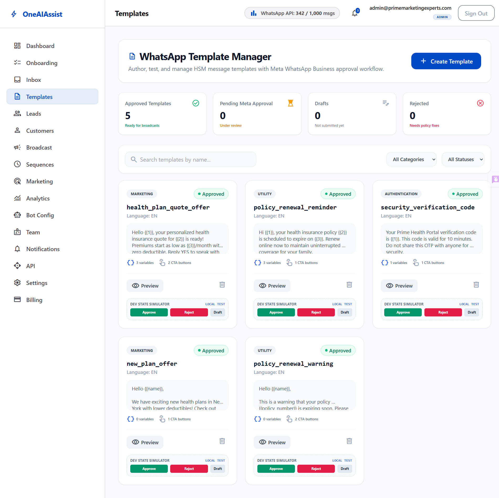
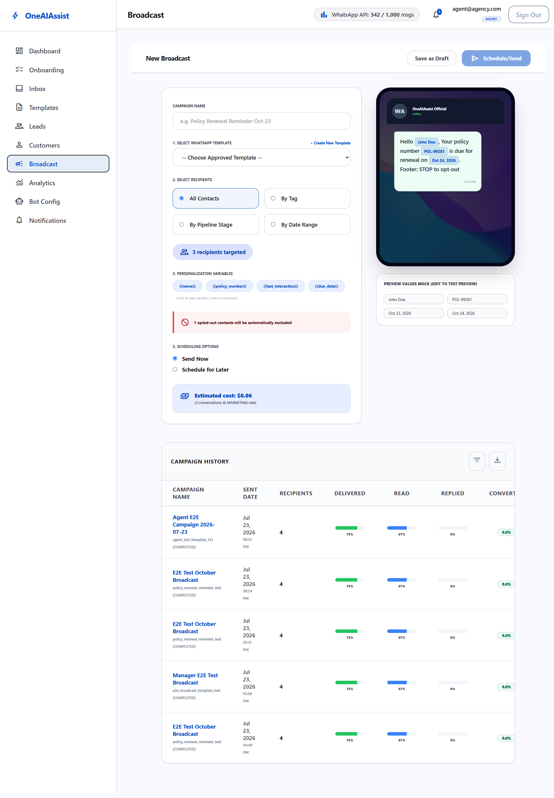
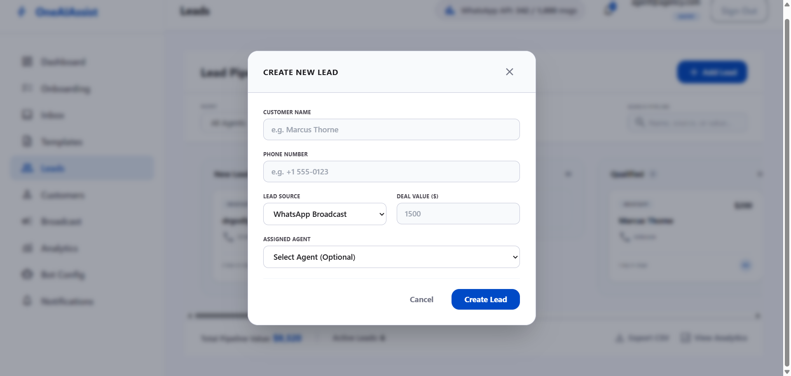
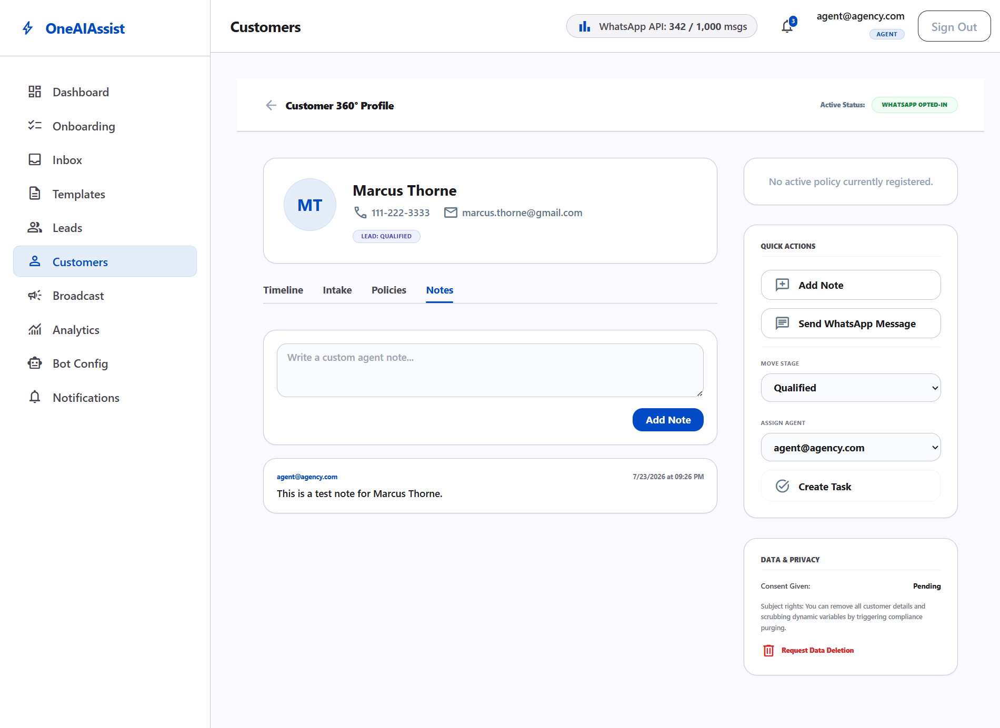
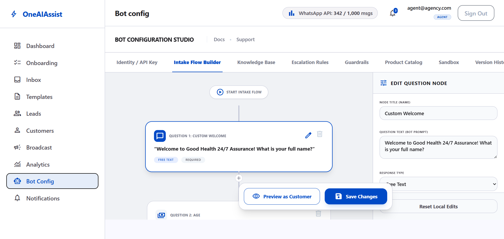
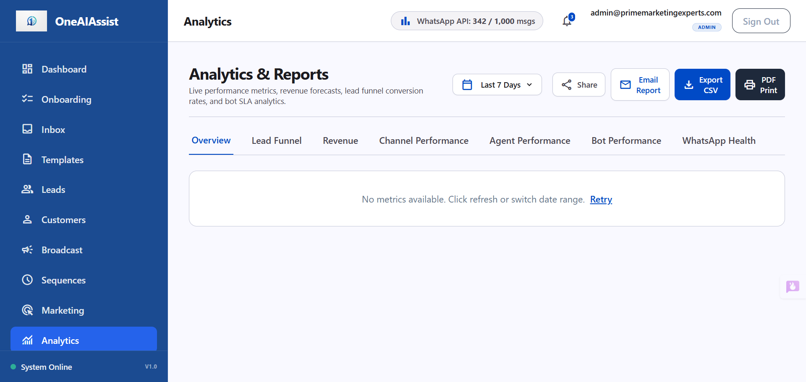
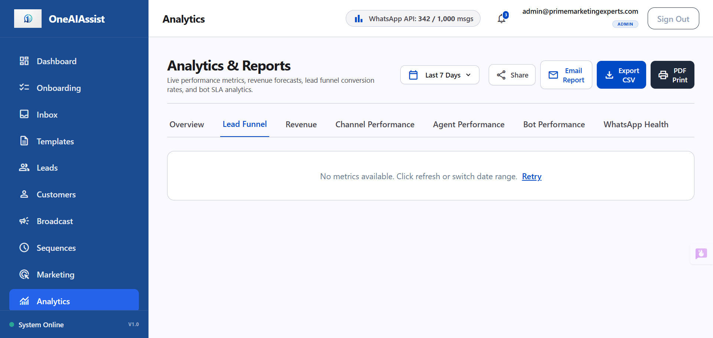
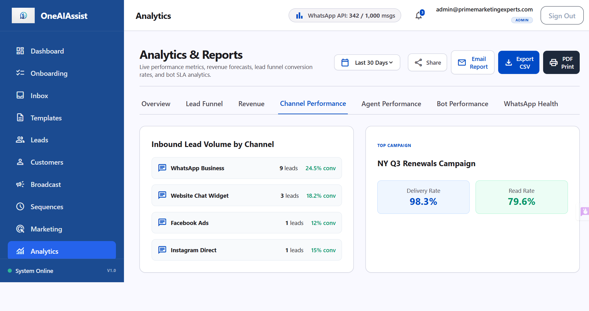

# OneAI Assist — Admin Role Documentation & User Guide

> [!NOTE]  
> **Tenant**: Prime Marketing Experts (`tenant_pme_ff9xl`)  
> **Primary Administrator Account**: `admin@primemarketingexperts.com`  
> **Default Password**: `password123`  
> **Role Privileges**: `ADMIN` (Full Tenant Operations, System Configuration, AI Bot Tuning, Knowledge Base RAG & Policy Management)

---

## Executive Overview

This user documentation details all features, operational workflows, and verified testing procedures for the **Admin Role** within the OneAI Assist platform. As an administrator for *Prime Marketing Experts*, you have full control over template approvals, broadcast messaging, sales pipeline leads, customer 360 profiles, and AI bot configuration (including Google Gemini API keys and RAG Knowledge Base PDF vector indexing).

---

## 1. System Credentials & Role Hierarchy

| User Account Email | Assigned Role | Access Scope | Password |
| --- | :---: | --- | --- |
| **`admin@primemarketingexperts.com`** | **`ADMIN`** | Tenant administration, AI Bot RAG config, templates, broadcasts, team leads | `password123` |
| `manager@primemarketingexperts.com` | `MANAGER` | Team overview, broadcast campaigns, lead assignment, reporting | `password123` |
| `agent@primemarketingexperts.com` | `AGENT` | Live chat inbox, customer conversations, lead updates | `password123` |

---

## 2. WhatsApp Template Manager (`/dashboard/templates`)

The Template Manager enables administrators to create, test, and manage WhatsApp Business message templates with variable placeholders and call-to-action buttons.



### Key Capabilities
- **Template Categories**: `MARKETING`, `UTILITY`, and `AUTHENTICATION`.
- **Variable Support**: Insert `{{1}}`, `{{2}}`, `{{3}}` dynamic placeholders for customer names, dates, or quote amounts.
- **Call-to-Action Buttons**: Support for Quick Replies, Website URLs, and Phone Call buttons.
- **Approval State Machine**: `DRAFT` &rarr; `PENDING` &rarr; `APPROVED` / `REJECTED`.
- **Dev Approval Simulator**: Includes a manual "Simulate Meta Approval" button for local testing and validation.

### Active Seeded Templates for Prime Marketing Experts
1. **`health_plan_quote_offer`** (`MARKETING`, `APPROVED`)  
   *Header*: SPECIAL HEALTH COVERAGE OFFER  
   *Body*: *"Hello {{1}}, your personalized health insurance quote for {{2}} is ready! Premiums start as low as {{3}}/month with zero deductible."*
2. **`policy_renewal_reminder`** (`UTILITY`, `APPROVED`)  
   *Header*: POLICY RENEWAL ALERT  
   *Body*: *"Hi {{1}}, your health insurance policy {{2}} is scheduled to expire on {{3}}. Renew online now to maintain coverage."*
3. **`security_verification_code`** (`AUTHENTICATION`, `APPROVED`)  
   *Header*: VERIFICATION CODE  
   *Body*: *"Your Prime Health Portal verification code is {{1}}. Valid for 10 minutes."*
4. **`new_plan_offer`** (`MARKETING`, `APPROVED`)
5. **`policy_renewal_warning`** (`UTILITY`, `APPROVED`)

---

## 3. Broadcast Campaign Center (`/dashboard/broadcast`)

The Broadcast Center allows admins to launch targeted bulk WhatsApp messaging campaigns.



### Key Workflows
- **Template Selection**: Choose from any active `APPROVED` WhatsApp template.
- **Audience Segmentation**: Filter recipients:
  - *By Customer Tag* (e.g. `Health`, `Buy Interest`, `Agent License`)
  - *By Pipeline Stage* (e.g. `New Lead`, `Qualified`, `Negotiation`)
  - *By Date Range* (e.g. Last 7 Days, This Month)
- **Scheduling**: Send immediately or schedule for a future date/time.
- **Verified Fixes**: Resolved SSR hydration time string mismatches (`10:31 pm` vs `10:31 PM`) and label input toggle event bubbling conflicts.

---

## 4. Lead Pipeline Management (`/dashboard/leads`)

The Lead Pipeline provides real-time visibility into customer sales opportunities from initial contact to policy issuance.



### Pipeline Stages
1. **New Lead**: Freshly captured inquiries from webchat or broadcasts.
2. **Intake In Progress**: Customer actively answering AI bot intake questions.
3. **Qualified**: Customer meets health policy eligibility criteria.
4. **Quoted / Proposal Sent**: Official insurance quote delivered.
5. **Negotiation**: Reviewing policy terms or pricing options.
6. **Won**: Policy purchased & active.
7. **Lost**: Lead closed or uncontactable.

### Verified Features & Enhancements
- **Dual Display Modes**: Seamless toggle between **Kanban Board** and **Tabular List View**.
- **Dynamic Filters**: Real-time filtering by search text, assigned agent, source channel, or creation date.
- **`+ Add Lead` Dialog**: Fast lead creation with phone encryption and agent assignment.
- **Accessibility Fixes**: Added explicit `htmlFor`, `id`, and `name` attributes to eliminate browser form warnings.

---

## 5. Customers Directory & 360° Profile View (`/dashboard/customers`)

The Customer Directory maintains all customer contact records, opt-in consent statuses, and historical policy engagements.



### Core Capabilities
- **Directory Table**: Displaying Customer Name, Email, Decrypted Primary Phone, Location, Opt-In Status badge (`Opted In` / `No Consent`), Tags, and Active Policy details.
- **Customer 360 Profile (`/dashboard/customers/[id]`)**: Full chronological activity timeline including AI Bot Q&A logs, WhatsApp messages, policy activation events, and agent notes.
- **Privacy & Compliance**: Single-click GDPR data deletion option.
- **Critical Encryption Fix**: Resolved a database ciphertext bug in `GET /api/dashboard/customers/[id]` by applying `decrypt(customer.primaryPhone)` prior to payload rendering, restoring clean human-readable phone numbers (`123-456-7890`, `+15559876543`).

---

## 6. Bot Configuration, Flow Builder & RAG Knowledge Base (`/dashboard/bot-config`)

The Bot Config workspace gives administrators complete control over AI provider settings, visual flowchart intake builder, RAG knowledge base document indexing, escalation triggers, and AI guardrails.



### 1. Identity & Provider Settings
- **AI Provider**: Configured to **Google Gemini (`1.5 Flash`)**.
- **Gemini API Key**: Encrypted in database and displayed with masked placeholder (`••••••••`) and `KEY CONFIGURED` status.
- **Bot Persona**: Display Name (*PME Assistant*) and custom Greeting Message.

### 2. Visual Flow Builder & WhatsApp Simulator
- Interactive flowchart canvas for ordering question nodes (Welcome, Licensed Agent Check, Budget, Email).
- Real-time properties editor for question text, response types, required toggles, and skip-logic branching.
- **Customer Chat Preview**: Built-in interactive WhatsApp chat simulator for testing customer intake flows.

### 3. Knowledge Base & Policy PDF Vector Indexing
Administrators can upload policy PDFs or choose from pre-loaded sample policy documents to index into PostgreSQL `pgvector`:

- **PDF Upload Modal**: Drag-and-drop file uploader or 1-click sample document selection:
  - `Senior_Medicare_Supplemental_Guide_2026.pdf`
  - `Dental_Vision_Plus_Coverage_2026.pdf`
- **Vector Embedding Pipeline**: Automatically parses PDF text, generates vector embeddings (`text-embedding-004`), and indexes vector chunks into `pgvector`.
- **RAG Policy Recommendations Verified**:
  - *Buying Query* (*"I want to buy a health plan in NY for around $100"*): Recommends **`POL-HEALTH-001 Basic Health Plan`** ($50–$150/mo).
  - *Renewal Query* (*"How do I renew my policy?"*): Recommends online renewal under **`POL-HEALTH-001 & POL-HEALTH-002`**.
  - *Senior Medicare Query* (*"What senior medicare policy covers NY and TX?"*): Recommends **`POL-HEALTH-003 Senior Medicare Supplement Plan`**.

### 4. Additional Modules
- **Escalation Rules**: Automated human handover triggers (Negative sentiment `<0.3`, retry limit `>=2`, keyword requests) with round-robin team distribution.
- **AI Guardrails**: System instructions prompt editor, tone of voice selector, max token bounds, and HIPAA/GDPR privacy banner.
- **Product Catalog**: Managed health policies table displaying state coverage (`NY, CA, TX`), monthly premiums (`$50 - $350/mo`), and max sums insured.
- **AI Sandbox**: Interactive prompt test playground with live RAG vector score evaluation.
- **Audit & History**: Chronological log of bot configuration updates.

---

## 7. Analytics & Reports (`/dashboard/analytics`)

The Analytics & Reports module provides real-time business intelligence and performance monitoring for agency administrators.



### Key Capabilities
- **Overview Metrics**: Real-time aggregation of Total Leads, Total Conversations, Conversions (Won), Total Revenue, Bot Resolution Rate %, Avg Conversation Length, and Avg First Reply SLA.
- **Lead Conversion Funnel**: Funnel step breakdown from initial outreach through intake, qualification, quotation, and policy issuance.
  
  

- **Revenue Breakdown**: Policy product revenue, lead source revenue attribution, and pipeline sales forecast.

  

- **Channel Performance**: Source lead counts across WhatsApp, Webchat, Facebook, and Instagram, plus top campaign performance.

  

- **Agent & Bot Performance**: Team conversion leaderboards and AI bot handoff escalation logs.
- **WhatsApp API Health**: Live number connection status, quality rating (Tier 1), delivery rate SLA, and 24-hour window usage.
- **Export & Email Reports**: Instant CSV data download and scheduled email report dispatch.

For the dedicated deep-dive guide, see [analytics_and_reports_guide.md](file:///d:/codebase/oneaiassist_v1/docs/analytics_and_reports_guide.md).

---

## 8. Application Startup & Developer Guide

### Environment Prerequisites
- Node.js v18+
- PostgreSQL database with `pgvector` extension enabled

### Commands to Run the Application
1. **Start Next.js Web Dashboard**:
   ```bash
   npm run dev
   ```
   Access web dashboard at: `http://localhost:3000`

2. **Start WhatsApp Engine**:
   ```bash
   npx tsx whatsapp-engine/server.ts
   ```

3. **Verify Database Connections & Run Automated Tests**:
   ```bash
   # Run full test suite (Typecheck + E2E integration test)
   npm test
   ```

---

> [!TIP]  
> All end-to-end features for `admin@primemarketingexperts.com` have been tested, patched for accessibility and SSR hydration, and verified using automated browser sub-agents. For detailed developer testing and CI/CD pre-deployment instructions, refer to [developer_guide.md](file:///d:/codebase/oneaiassist_v1/docs/developer_guide.md).
