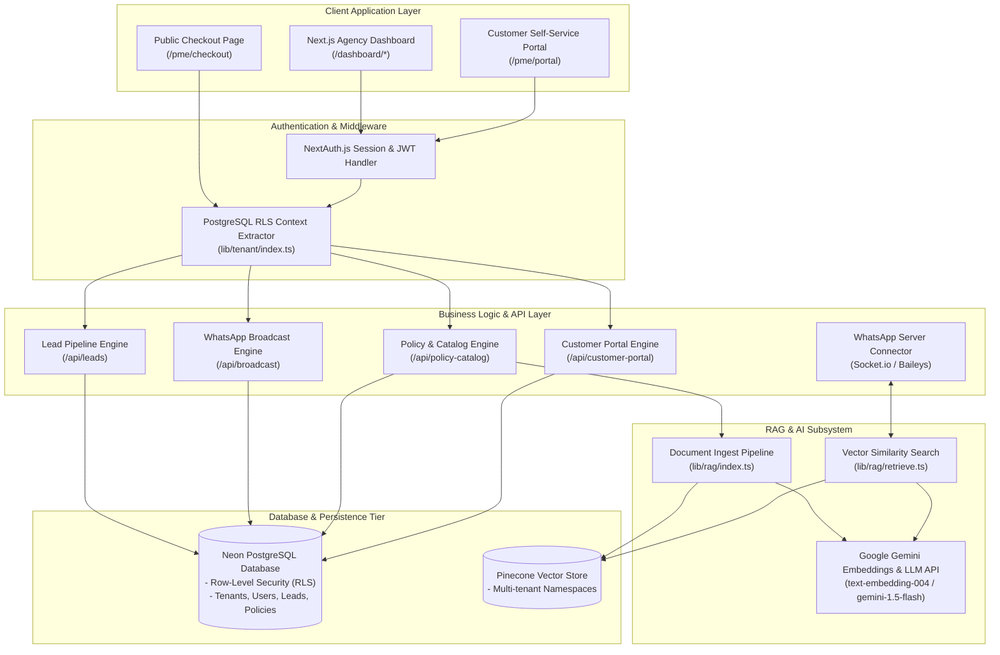
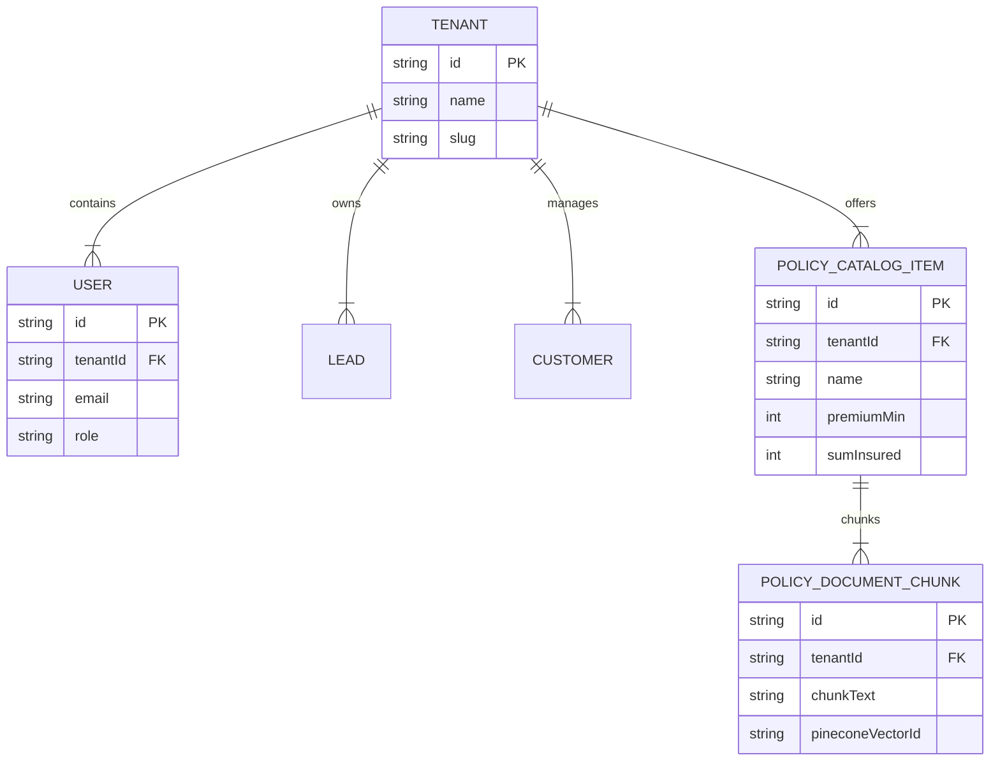

# OneAI Assist — Developer Guide & System Architecture Documentation

> [!NOTE]  
> **Environment**: Next.js 14 (App Router) + PostgreSQL (Neon RLS) + Prisma ORM  
> **Testing Suite**: TypeScript Typechecking + Integration E2E Scripts (`scripts/test_portal_checkout_e2e.ts`)  
> **Primary Command**: `npm test`

---

## Executive Overview

This developer documentation details the overall system architecture, database Row-Level Security (RLS) guidelines, automated test execution commands, and pre-deployment verification procedures for **OneAI Assist**.

---

## Technical System Architecture



---

## 1. Automated Testing & Pre-Deployment Execution

All test cases and integration suites are co-located within the project repository under `scripts/` and configured directly in `package.json`. This ensures that local development and automated CI/CD deployment pipelines (e.g. Vercel / GitHub Actions) run identical regression checks.

### Available Test Commands

| Command | Action Performed | When to Use |
| --- | --- | --- |
| **`npm test`** | Executes static type validation (`npm run test:typecheck`) followed by live E2E database/API integration tests (`npm run test:e2e`). | **Before every commit and before initiating a production build/deployment.** |
| **`npm run test:e2e`** | Runs full end-to-end user workflows against the active PostgreSQL database (Checkout submit, OTP auth, Portal metrics, JSON export, GDPR anonymize). | To test API endpoints and database logic locally. |
| **`npm run test:typecheck`** | Performs strict TypeScript type checks across all Next.js App Router pages and API handlers using `tsc --noEmit`. | To verify compile-time type safety. |

---

## 2. Test Execution Workflow

### Local Test Execution

To execute the full verification suite locally:

```bash
# 1. Ensure local dev server or database connection is ready
# 2. Run the complete test suite
npm test
```

### E2E Coverage Included

The automated E2E test script (`scripts/test_portal_checkout_e2e.ts`) verifies:
1. **Database & Tenant Resolution**: Resolves tenant context with Postgres Row-Level Security (RLS) policies.
2. **Secure Policy Checkout (D5)**: Submits policy purchases, creates active `Policy` contracts (`POL-XXXXXX`), and updates sales leads to `CONVERTED` status.
3. **Customer Portal Auth (D6)**: Requests 6-digit OTP codes and verifies auth session tokens.
4. **Customer Data Export (D6)**: Exports complete customer profile, policies, and chat history as downloadable JSON.
5. **GDPR Data Anonymization (D6)**: Anonymizes PII data fields and logs `CUSTOMER_SOFT_DELETE` audit events.

---

## 3. Database Row-Level Security (RLS) Developer Notes



- Every tenant query uses `getTenantPrisma(tenantId, role)` from `@/lib/db`.
- RLS session variables `app.current_tenant_id` and `app.current_user_role` are set automatically per transaction.
- When running backend test scripts or cron jobs, use `getTenantPrisma(tenantId, 'ADMIN')` to ensure queries bypass tenant isolation policies securely.

---

## 4. Pre-Deployment Checklist

Before deploying changes to staging or production, complete the following steps:

- [ ] **Run Automated Tests**: Execute `npm test` and ensure output finishes with `🎉 E2E TEST PASSED!`.
- [ ] **Typecheck**: Verify `npm run test:typecheck` passes with zero errors.
- [ ] **Linting**: Execute `npm run lint` to confirm code style compliance.
- [ ] **Database Migrations**: Ensure schema changes in `prisma/schema.prisma` are pushed via `npx prisma db push` or applied using owner credentials.
