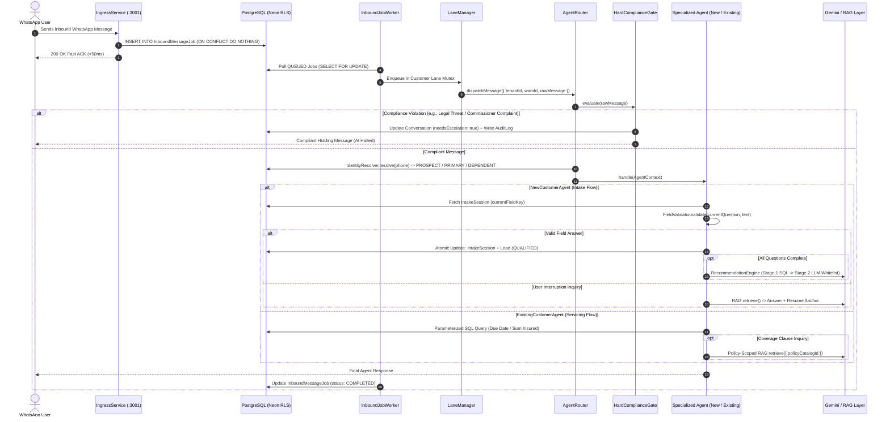
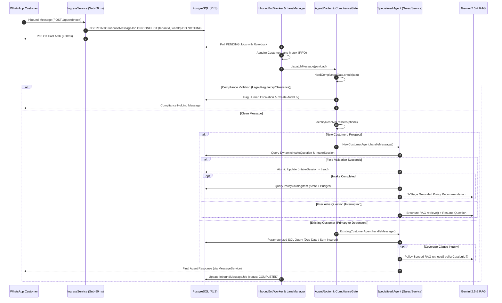

# Dual-Agent WhatsApp Insurance Engine — Technical Architecture & Implementation Guide
**Author:** AI Engineering Team  
**Version:** 4.0 (Phases 1, 2, 3, and 4 Complete)  
**Target Audience:** Core Engineering Team, Backend Developers, AI/ML Engineers, DevOps  

---

## Table of Contents
1. [Executive Summary & High-Level Architecture](#1-executive-summary--high-level-architecture)
2. [Phase 1: Database Schema & Tenant RLS Infrastructure](#2-phase-1-database-schema--tenant-rls-infrastructure)
3. [Phase 2: Ingress Unification, Idempotency & Concurrency](#3-phase-2-ingress-unification-idempotency--concurrency)
4. [Phase 3: Autonomous Agents, State Machine & Grounded RAG](#4-phase-3-autonomous-agents-state-machine--grounded-rag)
5. [Phase 4: Admin Observability, Live Inbox Controls & Outbound Sync](#5-phase-4-admin-observability-live-inbox-controls--outbound-sync)
6. [End-to-End System Data Flow](#6-end-to-end-system-data-flow)
7. [API & Module Reference](#7-api--module-reference)
8. [Verification Gates & Test Suite](#8-verification-gates--test-suite)
9. [Maintenance, Operations & Live WhatsApp Release Checklist](#9-maintenance-operations--live-whatsapp-release-checklist)

---

## 1. Executive Summary & High-Level Architecture

The **Dual-Agent WhatsApp Insurance Engine** is a high-throughput, multi-tenant conversational platform designed specifically for health insurance brokerage and policy servicing.

The engine replaces rigid rule-based bots with two specialized autonomous agents orchestrated through an upstream compliance, identity, and concurrency pipeline:

1. **`NewCustomerAgent` (Sales & Intake)**: Drives dynamic database-configured intake qualification, handles mid-conversation brochure questions via semantic RAG with automatic context resumption, and issues strictly grounded 2-stage policy recommendations (0% hallucination guarantee).
2. **`ExistingCustomerAgent` (Servicing & Operations)**: Executes zero-hallucination parameterized SQL lookups for due dates, sum insured, and premiums; executes policy-scoped vector RAG for coverage clause inquiries; and manages family dependent accounts.

### Core Architectural Principles
- **PostgreSQL Row-Level Security (RLS)**: Enforces tenant data isolation at the database layer via session variables (`app.current_tenant_id`).
- **Sub-50ms Atomic Ingress**: Webhooks are acknowledged in $<50$ms via an atomic `INSERT ... ON CONFLICT ("tenantId", "wamId") DO NOTHING` queue.
- **Per-Customer FIFO Lane Mutex**: Ensures messages from the same user are processed in strict chronological order without out-of-order state mutations.
- **Fail-Closed Compliance Gate**: Deterministic upstream regex filter that intercepts legal threats, regulatory complaints, grievances, and cancellations before any AI invocation.
- **Zero Hallucination Grounding**: All recommendations and servicing details are strictly filtered through deterministic SQL and whitelisted candidate schemas.

```mermaid
graph TD
    User([Customer on WhatsApp]) -->|Inbound Webhook| TransportIngress[Unified Ingress Layer: Meta / Baileys / OpenWA / Webchat]
    TransportIngress -->|Atomic DB Insert| IngressService[IngressService.enqueueInboundJob]
    IngressService -->|200 OK in <50ms| FastACK([Fast Webhook ACK])
    
    subgraph AsyncWorker [Async Worker & Concurrency Layer]
        InboundJobWorker[InboundJobWorker (Polls QUEUED Jobs)]
        InboundJobWorker --> LaneManager[LaneManager (Per-Customer FIFO Mutex)]
        LaneManager --> AgentRouter[AgentRouter.dispatchMessage]
    end
    
    subgraph UpstreamFilters [Upstream Interceptors]
        AgentRouter --> HardComplianceGate{Hard Compliance Gate}
        HardComplianceGate -->|Violation| SupervisorEscalate[Escalate to Human Supervisor & AuditLog]
        HardComplianceGate -->|Pass| IdentityResolver[IdentityResolver.resolve]
    end
    
    IdentityResolver -->|PROSPECT| NewCustomerAgent[NewCustomerAgent]
    IdentityResolver -->|PRIMARY / DEPENDENT| ExistingCustomerAgent[ExistingCustomerAgent]
    
    subgraph NewCustomerAgentPipeline [NewCustomerAgent Flow]
        NewCustomerAgent --> CheckIntake[IntakeSession & DynamicIntakeQuestion]
        CheckIntake --> TryVal{Validation-First Parsing}
        TryVal -->|Valid Answer| SaveAtomic[Atomic DB Tx: IntakeSession + Lead]
        SaveAtomic --> IsDone{All Steps Done?}
        IsDone -->|No| NextQ[Prompt Next Step]
        IsDone -->|Yes| RecEngine[Two-Stage RecommendationEngine]
        
        TryVal -->|Invalid Answer| CheckInquiry{Is Message Inquiry?}
        CheckInquiry -->|Yes & Interruptions < 3| BrochureRAG[Brochure RAG + Resume Anchor]
        CheckInquiry -->|Yes & Interruptions >= 3| InterruptionGuard[Interruption Guard Nudge]
        CheckInquiry -->|No| RePrompt[Re-prompt with HelpText]
    end
    
    subgraph ExistingCustomerAgentPipeline [ExistingCustomerAgent Flow]
        ExistingCustomerAgent --> IntentClassifier{Intent Classifier}
        IntentClassifier -->|Due Date / Premium| SQLLookupDue[Parameterized SQL Due Date Query]
        IntentClassifier -->|Sum Insured / Limit| SQLLookupSum[Parameterized SQL Sum Insured Query]
        IntentClassifier -->|Benefits / Co-pay / Exclusions| PolicyRAG[Policy-Scoped Vector RAG via Catalog ID]
        IntentClassifier -->|Claim / Endorsement / Cancel| ServiceEscalate[Flag Servicing Human Escalation]
    end
```

---

## 2. Phase 1: Database Schema & Tenant RLS Infrastructure

### 2.1 Prisma Schema Models

The schema incorporates dynamic question metadata, atomic message job tracking, session field progression, and family account relations:

#### `DynamicIntakeQuestion`
Configures database-driven, tenant-customizable intake onboarding steps.
```prisma
enum ValidationType {
  NUMBER
  US_STATE
  CURRENCY
  ENUM
  PHONE
  EMAIL
  DATE
  TEXT
}

model DynamicIntakeQuestion {
  id              String         @id @default(cuid())
  tenantId        String
  stepOrder       Int
  fieldKey        String         // "age", "state", "budget", "family_size", "conditions"
  questionPrompt  String         @db.Text
  validationType  ValidationType @default(TEXT)
  isMandatory     Boolean        @default(true)
  isSkippable     Boolean        @default(false)
  options         Json?          // Array of choices for buttons / quick replies
  isActive        Boolean        @default(true)
  createdAt       DateTime       @default(now())
  updatedAt       DateTime       @updatedAt

  tenant          Tenant         @relation(fields: [tenantId], references: [id], onDelete: Cascade)

  @@unique([tenantId, stepOrder])
  @@unique([tenantId, fieldKey])
  @@index([tenantId, isActive])
}
```

#### `InboundMessageJob`
Implements the crash-resilient 2-stage queue lifecycle.
```prisma
enum InboundJobStatus {
  RECEIVED
  QUEUED
  PENDING
  PROCESSING
  COMPLETED
  FAILED
}

model InboundMessageJob {
  id             String           @id @default(cuid())
  tenantId       String
  wamId          String?          // Meta WhatsApp Message ID (external dedup key)
  senderPhone    String?          // E.164 normalized phone
  recipientId    String?          // Business Phone ID
  payload        Json?            // Raw webhook payload
  conversationId String?          // Nullable at ingress; populated upon dispatch
  messageId      String?          @unique // FK to Message entity
  status         InboundJobStatus @default(RECEIVED)
  attempts       Int              @default(0)
  maxAttempts    Int              @default(3)
  lastError      String?
  lockedAt       DateTime?        // Supervisor lock timestamp
  createdAt      DateTime         @default(now())
  updatedAt      DateTime         @default(now()) @updatedAt
  processedAt    DateTime?

  tenant         Tenant           @relation(fields: [tenantId], references: [id], onDelete: Cascade)

  @@unique([tenantId, wamId])     // DB-level idempotency constraint
  @@index([tenantId])
  @@index([status, createdAt])
}
```

#### `IntakeSession` (Extensions)
```prisma
model IntakeSession {
  id                String              @id @default(cuid())
  tenantId          String
  leadId            String              @unique
  customerId        String
  flowId            String
  flowVersion       String
  status            IntakeSessionStatus @default(IN_PROGRESS)
  currentFieldKey   String?             // Immutable fieldKey of active question
  interruptionCount Int                 @default(0)
  isComplete        Boolean             @default(false)
  collectedFields   Json                // Key-value store of validated answers
  createdAt         DateTime            @default(now())
  updatedAt         DateTime            @updatedAt
  completedAt       DateTime?

  tenant            Tenant              @relation(fields: [tenantId], references: [id], onDelete: Cascade)
  lead              Lead                @relation(fields: [leadId], references: [id], onDelete: Cascade)
  customer          Customer            @relation(fields: [customerId], references: [id], onDelete: Cascade)

  @@index([tenantId])
  @@index([leadId])
  @@index([customerId])
}
```

#### `Customer` (Dependent Self-Relation)
```prisma
model Customer {
  id                String    @id @default(cuid())
  tenantId          String
  displayName       String
  primaryPhone      String    // Canonical E.164 phone
  activePolicyId    String?
  primaryCustomerId String?   // Parent customer ID for dependents

  tenant            Tenant    @relation(fields: [tenantId], references: [id], onDelete: Cascade)
  primaryCustomer   Customer? @relation("CustomerDependents", fields: [primaryCustomerId], references: [id], onDelete: SetNull)
  dependents        Customer[]@relation("CustomerDependents")
  // ...
}
```

### 2.2 PostgreSQL Row-Level Security (RLS) Invariant
Every direct raw query and Prisma operation against tenant tables (`Customer`, `Lead`, `Policy`, `InboundMessageJob`, `AuditLog`, `Conversation`) **must** set the session tenant variable:
```ts
// Using tenant Prisma helper:
const db = getTenantPrisma(tenantId, 'ADMIN');

// Or within raw transactions:
await tx.$executeRawUnsafe(
  `SELECT set_config('app.current_tenant_id', $1, true), set_config('app.current_user_role', 'ADMIN', true);`,
  tenantId
);
```
Failing to set `app.current_tenant_id` results in PostgreSQL error `42501 (violates row-level security policy)`.

---

## 3. Phase 2: Ingress Unification, Idempotency & Concurrency

### 3.1 Unified Ingress Service (`IngressService.ts`)
All inbound transports (Meta Cloud API, Baileys WebSocket, OpenWA Chromium, Webchat REST) normalize payloads and call `enqueueInboundJob`:

```ts
// Location: whatsapp-engine/agents/IngressService.ts
export async function enqueueInboundJob(params: IngressParams): Promise<IngressResult> {
  const { tenantId, wamId, senderPhone, recipientId, payload } = params;
  
  // Atomic DB Insert: INSERT ... ON CONFLICT ("tenantId", "wamId") DO NOTHING
  const result = await prisma.$executeRawUnsafe(`
    INSERT INTO "InboundMessageJob" ("id", "tenantId", "wamId", "senderPhone", "recipientId", "payload", "status", "attempts", "createdAt", "updatedAt")
    VALUES ($1, $2, $3, $4, $5, $6::jsonb, 'QUEUED', 0, NOW(), NOW())
    ON CONFLICT ("tenantId", "wamId") DO NOTHING;
  `, id, tenantId, wamId, normalizedPhone, recipientId, JSON.stringify(payload));

  if (result === 0) {
    return { accepted: false, isDuplicate: true }; // Duplicate dropped in <50ms
  }
  return { accepted: true, isDuplicate: false, jobId: id };
}
```

### 3.2 Upstream Fail-Closed Compliance Gate (`HardComplianceGate.ts`)
Evaluates every message using deterministic high-precision regex before any agent or LLM execution:
- **`LEGAL_THREAT`**: attorney, lawyer, sue, lawsuit, litigation, legal counsel
- **`REGULATORY_COMPLAINT`**: insurance commissioner, department of insurance, doi complaint, bbb, ftc
- **`CLAIM_DISPUTE`**: claim denied, appeal denial, bad faith, refusal to pay
- **`GRIEVANCE`**: formal grievance, dispute charges, scam, fraud
- **`POLICY_CANCELLATION`**: cancel my policy, terminate coverage immediately

When triggered:
1. Updates `Conversation`: `needsEscalation: true`, `automationEnabled: false`, `escalationReason: 'COMPLIANCE_...'`.
2. Inserts an immutable record into `AuditLog` with `action: 'COMPLIANCE_ESCALATION_TRIGGERED'`.
3. Emits a real-time `compliance_alert` via Socket.io.
4. Returns a standard compliant holding message directly.

### 3.3 Per-Customer Lane Mutex (`LaneManager.ts`)
To prevent race conditions and out-of-order processing when a user sends multiple messages in rapid succession:
- An in-memory sequential promise chain per `${tenantId}:${senderPhone}`.
- Message 2 waits until Message 1 completely updates the database state before executing.

### 3.4 Asynchronous Inbound Worker (`InboundJobWorker.ts`)
- **Queue Poller**: Selects batches of `QUEUED` jobs.
- **Optimistic Locking**: Updates row to `PROCESSING` with `lockedAt: new Date()` and increments `attempts`.
- **Stale Lock Supervisor**: Automatically recovers jobs stuck in `PROCESSING` where `lockedAt < NOW() - INTERVAL '5 minutes'`.
- **Dead-Letter Handling**: After 3 failed attempts, marks job `FAILED`, writes to `AuditLog`, and emits `system_alert`.

---

## 4. Phase 3: Autonomous Agents, State Machine & Grounded RAG

### 4.1 Deterministic Field Validator (`FieldValidator.ts`)
Implements the **Validation-First Strategy**. Evaluates incoming answers against the expected `ValidationType` before checking for interruptions:
- **`NUMBER`**: Extracts numbers; enforces domain limits (age: 1–120, family: 1–30).
- **`US_STATE`**: Normalizes all 50 US state names and abbreviations. Employs token-length heuristics to avoid false positives (e.g. "co-pays" vs. "CO").
- **`CURRENCY`**: Extracts dollar figures. Resolves ranges (e.g. "$150-$250") to upper bound ($250) as the budget ceiling for database filtering.
- **`ENUM`**: Evaluates **exact match first**; falls back to substring match *strictly* if exactly 1 option matches. Re-prompts if ambiguous.

### 4.2 Two-Stage Grounded Recommendation Engine (`RecommendationEngine.ts`)

#### Stage 1: Deterministic SQL Candidate Search
```ts
const candidates = await db.policyCatalogItem.findMany({
  where: {
    tenantId,
    active: true,
    states: { has: userState }, // or national policies
    premiumMin: { lte: userBudgetMaxCents },
  },
});
```

#### Strict 0 / 1 / >1 Candidate Branching:
1. **0 Candidates**:
   - Bypasses LLM synthesis entirely.
   - Sets `status = 'HUMAN_ESCALATED'`, flags `needsEscalation: true`.
   - Informs prospect that custom underwritten options are being reviewed by a human specialist (prevents force-fitting unsupported budgets or states).
2. **1 Candidate**:
   - Bypasses LLM ranking.
   - Formats single verified plan directly with exact carrier, premium range, and sum insured.
   - Sets `Lead.status = 'QUALIFIED'` and updates `recommendedPolicyIds = [candidate.id]`.
3. **>1 Candidates (Stage 2 Grounded LLM Pitch)**:
   - Constrains Gemini prompt strictly to `candidateWhitelist` JSON.
   - Compares top options (Value Tier vs Comprehensive Tier).
   - Guarantees 0% hallucination of carriers, prices, or policy IDs.

### 4.3 New Customer Agent (`NewCustomerAgent.ts`)

#### State Progression Algorithm
1. Loads active tenant `DynamicIntakeQuestion`s sorted by `stepOrder ASC`.
2. Fetches `IntakeSession` using `currentFieldKey`.
3. Runs `FieldValidator.validate(currentQuestion, rawMessage)`.
4. **If Valid**:
   - Updates `collectedFields[currentFieldKey] = normalizedValue`.
   - Resets `interruptionCount = 0`.
   - Executes atomic transaction updating `IntakeSession` and `Lead`.
   - Advances to next question or invokes `RecommendationEngine`.
5. **If Invalid**:
   - Checks if message is an inquiry (e.g. "what is deductible?", "do you cover dental?").
   - **If Inquiry & `interruptionCount < 3`**:
     - Increments `interruptionCount`.
     - Calls unified `retrieve(tenantId, {}, rawMessage, 2)`.
     - Generates concise 1–2 sentence answer and appends anchor:  
       `👉 Now, returning to your quote: [Current Question Prompt]`
   - **If Inquiry & `interruptionCount >= 3` (Interruption Guard)**:
     - Skips RAG. Nudges user: *"I'd love to answer all your policy questions right after we complete your quick quote! Let's get your details first: [Question]"*
   - **If Invalid Format (Garbage Input)**:
     - Re-prompts with question's `helpText`.

### 4.4 Existing Customer Agent (`ExistingCustomerAgent.ts`)

#### Servicing Lookups & Scoped RAG
1. Identifies caller (Primary Policyholder vs Family Dependent).
2. Queries active `Policy` and `PolicyCatalogItem` records.
3. Classifies Intent:
   - **`BILLING / DUE DATE`**: Returns monthly premium ($), next billing date, and policy status.
   - **`SUM INSURED / LIMITS`**: Returns maximum coverage limit ($), effective and expiry dates.
   - **`POLICY SUMMARY`**: Returns plan name, insurer, and coverage validity.
   - **`COVERAGE CLAUSES (RAG)`**: Calls `retrieve(tenantId, { policyCatalogId: activePolicy.policyCatalogId }, rawMessage, 3)` to generate answers citing specific document clauses and page numbers.
   - **`ENDORSEMENTS / CLAIMS / CANCELLATION`**: Flags `needsEscalation: true` and transfers to customer service desk.

---

## 5. End-to-End System Data Flow



---

## 5. Phase 4: Admin Observability, Live Inbox Controls & Outbound Sync

### 5.1 Dynamic Intake Question Studio
The Dynamic Intake Question Studio allows admins to configure onboarding questions, validation rules, choices, step order, and active states dynamically via the UI and REST API without code modifications.

#### Dynamic Questions API (`/api/admin/intake-questions`):
- `GET`: Returns ordered active questions for the tenant.
- `POST`: Creates a new question with validation type (`NUMBER`, `US_STATE`, `CURRENCY`, `ENUM`, `PHONE`, `EMAIL`, `DATE`, `TEXT`).
- `PUT`: Updates an existing question prompt, help text, or active status.
- `PATCH`: Bulk reorders question sequence.
- `DELETE`: Removes a question.

### 5.2 Outbound WhatsApp Dispatch & Delivery Sync
- **`MessageService.sendMessage`**: Unified outbound messaging handler supporting Baileys WebSockets, OpenWA Chromium, and official Meta Cloud API.
- **`clientMessageId` Idempotency**: Prevents duplicate message transmission if the client re-submits a send request.
- **Real-Time Delivery Synchronization**: Emits Socket.io `new_message` and `message_status` events to update agent dashboards in real time.

### 5.3 Live Inbox Human Takeover & AI Auto-Pilot
- When an agent toggles **`automationEnabled: false`** on a conversation:
  1. Inbound messages are still ingested and saved to the message log.
  2. The `AgentRouter` skips autonomous AI dispatch, allowing the human agent to hold an uninterrupted conversation.
  3. When the human agent clicks **"Resume AI"** (`automationEnabled: true`), the autonomous agent picks up context and continues seamlessly.

### 5.4 System Health & Observability Metrics (`/api/admin/system-health`)
Provides real-time telemetry on:
- Inbound queue health (`PENDING`, `PROCESSING`, `COMPLETED`, `DEAD_LETTER`).
- Compliance escalation triggers and audit trail summaries.
- Dynamic question counts and active AI agent statuses.

---

## 6. End-to-End System Data Flow



---

## 7. API & Module Reference

### File Locations & Responsibilities

| Module | Path | Primary Purpose |
|---|---|---|
| **Core Types** | [`whatsapp-engine/agents/types.ts`](file:///d:/codebase/oneaiassist_v1/whatsapp-engine/agents/types.ts) | Agent interfaces, identity contracts, compliance intents, and context definitions |
| **Agent Registry** | [`whatsapp-engine/agents/AgentRegistry.ts`](file:///d:/codebase/oneaiassist_v1/whatsapp-engine/agents/AgentRegistry.ts) | Registration and resolution of specialized autonomous agents |
| **Agent Router** | [`whatsapp-engine/agents/AgentRouter.ts`](file:///d:/codebase/oneaiassist_v1/whatsapp-engine/agents/AgentRouter.ts) | Main dispatch pipeline: Compliance $\rightarrow$ Identity $\rightarrow$ Agent Execution |
| **Ingress Service** | [`whatsapp-engine/IngressService.ts`](file:///d:/codebase/oneaiassist_v1/whatsapp-engine/IngressService.ts) | Atomic DB deduplication (`wamId`), sub-50ms webhook ingress |
| **Compliance Gate** | [`whatsapp-engine/agents/HardComplianceGate.ts`](file:///d:/codebase/oneaiassist_v1/whatsapp-engine/agents/HardComplianceGate.ts) | Fail-closed deterministic regex filter & audit logging |
| **Identity Resolver** | [`whatsapp-engine/agents/IdentityResolver.ts`](file:///d:/codebase/oneaiassist_v1/whatsapp-engine/agents/IdentityResolver.ts) | E.164 normalization, customer type resolution, dependent account linking |
| **Lane Manager** | [`whatsapp-engine/agents/LaneManager.ts`](file:///d:/codebase/oneaiassist_v1/whatsapp-engine/agents/LaneManager.ts) | In-memory per-customer sequential FIFO mutex |
| **Inbound Worker** | [`whatsapp-engine/InboundJobWorker.ts`](file:///d:/codebase/oneaiassist_v1/whatsapp-engine/InboundJobWorker.ts) | Background queue processor, stale-lock supervisor, dead-letter alerts |
| **Field Validator** | [`whatsapp-engine/agents/FieldValidator.ts`](file:///d:/codebase/oneaiassist_v1/whatsapp-engine/agents/FieldValidator.ts) | Deterministic validation for states, budgets, numbers, and ENUMs |
| **Recommendation Engine** | [`whatsapp-engine/agents/RecommendationEngine.ts`](file:///d:/codebase/oneaiassist_v1/whatsapp-engine/agents/RecommendationEngine.ts) | 2-stage grounded recommendation engine with 0/1/>1 branching |
| **New Customer Agent** | [`whatsapp-engine/agents/NewCustomerAgent.ts`](file:///d:/codebase/oneaiassist_v1/whatsapp-engine/agents/NewCustomerAgent.ts) | Dynamic intake progression, brochure RAG, interruption guard, CRM sync |
| **Existing Customer Agent** | [`whatsapp-engine/agents/ExistingCustomerAgent.ts`](file:///d:/codebase/oneaiassist_v1/whatsapp-engine/agents/ExistingCustomerAgent.ts) | Parameterized SQL servicing lookups, policy-scoped RAG, dependent context |
| **Message Service** | [`whatsapp-engine/MessageService.ts`](file:///d:/codebase/oneaiassist_v1/whatsapp-engine/MessageService.ts) | Outbound WhatsApp dispatch, clientMessageId dedup, Socket.io sync |
| **Transport Manager** | [`whatsapp-engine/transport/TransportManager.ts`](file:///d:/codebase/oneaiassist_v1/whatsapp-engine/transport/TransportManager.ts) | Unified adapter across Baileys, OpenWA, and Meta Cloud API |
| **Intake Studio API** | [`app/api/admin/intake-questions/route.ts`](file:///d:/codebase/oneaiassist_v1/app/api/admin/intake-questions/route.ts) | CRUD & bulk reordering for Dynamic Intake Questions |
| **System Health API** | [`app/api/admin/system-health/route.ts`](file:///d:/codebase/oneaiassist_v1/app/api/admin/system-health/route.ts) | Real-time queue, compliance, and engine health metrics |

---

## 8. Verification Gates & Test Suite

All 4 phases are verified via standalone automated test scripts located in `scratch/`:

```bash
# Phase 1: Database Schema & Dynamic Intake Seeding
npx tsx scratch/test_phase1_db.ts

# Phase 2: Ingress, Concurrency, Compliance & Resolver
npx tsx scratch/test_idempotency_race.ts       # Gate 2.1: 10 parallel webhook race (1 created, 9 duplicates)
npx tsx scratch/test_compliance_gate.ts         # Gate 2.2: Fail-closed compliance triggers & audit logs
npx tsx scratch/test_dependent_resolution.ts    # Gate 2.3: Family dependent account linkage
npx tsx scratch/test_concurrency_lock.ts        # Gate 2.4: Per-customer FIFO sequential ordering
npx tsx scratch/test_dead_letter_alert.ts       # Gate 2.5: Dead-letter queue terminal failure

# Phase 3: Autonomous Agents, RAG & Recommendations
npx tsx scratch/test_dynamic_intake.ts          # Gate 3.1: 5-step dynamic intake & validation-first
npx tsx scratch/test_rag_interruption.ts        # Gate 3.2: Brochure RAG interruption & 3-turn guard
npx tsx scratch/test_recommendation_engine.ts   # Gate 3.3: Two-stage 0/1/>1 recommendation branching
npx tsx scratch/test_existing_customer_agent.ts # Gate 3.4: SQL due dates, sums, & policy RAG
npx tsx scratch/test_mid_intake_compliance.ts   # Gate 3.5: Mid-intake regulatory interception

# Phase 4: Admin Observability, Live Takeover & Outbound Dispatch
npx tsx scratch/test_dynamic_question_crud.ts   # Gate 4.1: Dynamic question CRUD & sequence reorder
npx tsx scratch/test_outbound_dispatch.ts       # Gate 4.2: Outbound dispatch & clientMessageId dedup
npx tsx scratch/test_human_takeover.ts          # Gate 4.3: Live Inbox human takeover & AI pause/resume
npx tsx scratch/test_system_health.ts           # Gate 4.4: System health queue observability metrics
```

---

## 9. Maintenance, Operations & Live WhatsApp Release Checklist

### 9.1 Gate 4.5: Real-Phone Live End-to-End Release Checklist
To verify the engine on a physical WhatsApp device before production launch:
1. **Connect Live WhatsApp Channel**: In `/dashboard/settings`, connect your WhatsApp line (Meta Cloud API, Baileys QR, or OpenWA).
2. **Test New Customer Flow**:
   - Send: `"Hi, I'm looking for a quote"` $\rightarrow$ Verify prompt asks Question 1.
   - Reply with valid answers turn-by-turn $\rightarrow$ Verify answers persist in Lead CRM.
   - Ask an interruption: `"Do you cover maternity?"` $\rightarrow$ Verify semantic RAG answer + resumption prompt.
   - Complete intake $\rightarrow$ Verify grounded recommendations with accurate monthly premium and sum insured.
3. **Test Existing Customer Flow**:
   - Save the phone number as an active policyholder in the Customers database.
   - Send: `"When is my next premium due?"` $\rightarrow$ Verify accurate date and amount returned from SQL database.
   - Send: `"What is my maximum coverage limit?"` $\rightarrow$ Verify exact sum insured returned.
4. **Test Live Takeover**:
   - In `/dashboard/inbox`, click the active thread and toggle **"AI Auto-Pilot" OFF**.
   - Send a message from the phone $\rightarrow$ Verify AI does not reply.
   - Send an agent reply from `/dashboard/inbox` $\rightarrow$ Verify instant delivery to phone.
   - Toggle **"AI Auto-Pilot" ON** $\rightarrow$ Verify AI resumes conversation.
5. **Test Compliance Interception**:
   - Send: `"I want to file a regulatory complaint with the insurance commissioner"` $\rightarrow$ Verify fail-closed escalation message and immediate supervisor alert in Audit Log.

