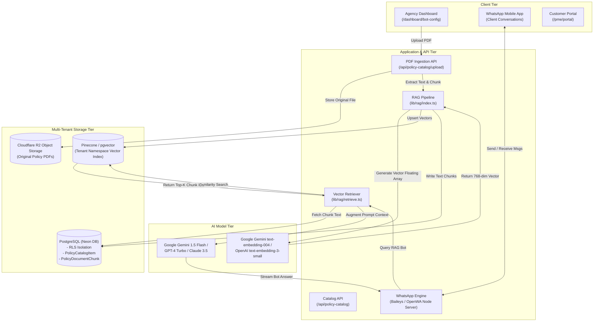
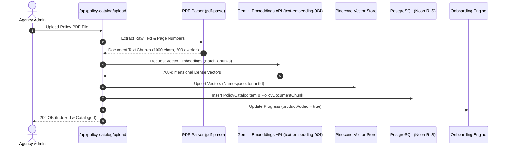
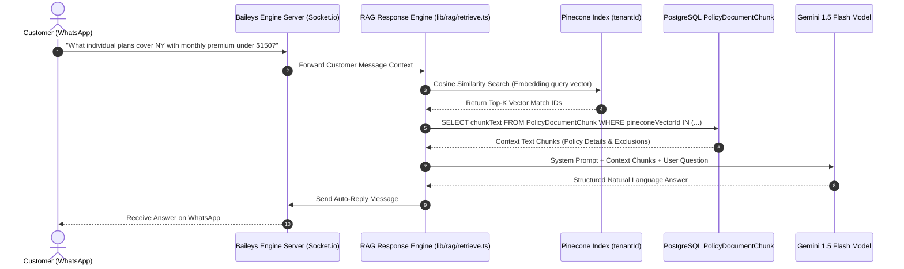

# Knowledge Base & RAG Architecture — Technical Documentation

## Executive Overview
The **OneAIAssist Knowledge Base & RAG (Retrieval-Augmented Generation) Subsystem** allows insurance agencies to upload policy documents (PDFs), chunk and embed textual policy rules, and provide intelligent, context-aware AI bot responses for client inquiries and automated onboarding workflows.

---

## Technical Architecture Diagram



---

## 1. Sequence Diagrams

### 1.1 Document Upload & Vector Indexing Sequence



### 1.2 Real-Time RAG Inquiry & AI Answer Sequence



---

## 2. AI Models Specification

### 2.1 Vector Embedding Models
* **Primary Embedding Model**: `text-embedding-004` (Google Gemini Embeddings API)
* **Secondary / Fallback Model**: `text-embedding-3-small` (OpenAI Embeddings API)
* **Dimensionality**: 768 / 1536 dense vector floating-point array
* **Purpose**: Converts extracted policy text chunks into high-dimensional semantic vector representations for similarity search.

### 2.2 Generative LLM Completion Models
* **Google Gemini 1.5 Flash** (`gemini-1.5-flash`): Default high-performance model for real-time RAG prompt completions and automated WhatsApp customer interactions.
* **GPT-4 Turbo** (`gpt-4-turbo`): Supported provider option for complex multi-policy reasoning.
* **Claude 3.5 Sonnet** (`claude-3-5-sonnet`): Supported provider option for strict policy guardrails.

---

## 3. Storage & Database Schema

After policy document upload and embedding generation, data is persisted across three distinct storage tiers:

### Tier 1: Vector Database (`Pinecone` & `pgvector`)
* **Content**: Numerical embedding floating-point arrays and vector IDs (`pineconeVectorId`).
* **Tenant Isolation**: Isolated by `tenantId` namespace in Pinecone or RLS-scoped rows in `pgvector`.
* **Purpose**: Performs sub-100ms cosine similarity / nearest-neighbor vector retrieval.

### Tier 2: Relational Database (`PostgreSQL / Neon DB`)
Data is stored across two primary Prisma models with Row-Level Security (RLS) enabled:

#### `PolicyCatalogItem` Table
Stores policy metadata displayed in the **Product Catalog** and **Knowledge Base** tabs:
```prisma
model PolicyCatalogItem {
  id               String   @id @default(cuid())
  tenantId         String
  policyId         String   // e.g. POL-HEALTH-001
  name             String   // e.g. Apex Care Basic Individual Health Plan
  insurerName      String   // e.g. Apex Health Care
  states           String[] // e.g. ["NY", "CA", "FL"]
  premiumMin       Int      // Minimum monthly premium in cents
  premiumMax       Int      // Maximum monthly premium in cents
  sumInsured       Int      // Maximum coverage limit in cents
  active           Boolean  @default(true)
  extractedSummary String   @db.Text
  pdfUrl           String   // Public or signed URL of original PDF document
  createdAt        DateTime @default(now())
  updatedAt        DateTime @updatedAt
}
```

#### `PolicyDocumentChunk` Table
Stores granular text chunks extracted from policy documents for RAG context building:
```prisma
model PolicyDocumentChunk {
  id               String   @id @default(cuid())
  tenantId         String
  policyCatalogId  String?  // Foreign key to PolicyCatalogItem
  policyId         String?  
  chunkText        String   @db.Text
  pageNumber       Int
  pineconeVectorId String   // Reference ID matching the vectorstore
  createdAt        DateTime @default(now())
}
```

### Tier 3: Object Storage (`Cloudflare R2`)
* **Content**: Raw original policy PDF files uploaded by agency managers.
* **Access**: Accessible via secure signed URLs saved in `PolicyCatalogItem.pdfUrl`.

---

## 4. RAG Document Ingestion Workflow

1. **Upload & Parsing**: PDF bytes are uploaded to `/api/policy-catalog/upload` and parsed into raw text using `pdf-parse`.
2. **AI Summary Generation**: An initial plain-language policy summary is generated using `gemini-1.5-flash` and stored in `PolicyCatalogItem.extractedSummary`.
3. **Chunking**: Full document text is split into chunks of `1000` characters with an overlap of `200` characters.
4. **Vector Embedding**: Each text chunk is passed to `embedder.getEmbedding(chunkText)` to produce vector embeddings.
5. **Vectorstore Ingestion**: Embedding vectors are upserted into **Pinecone** / **`pgvector`** under the active `tenantId` namespace.
6. **Relational Database Write**: Chunk text rows and metadata are saved to `PolicyDocumentChunk` and `PolicyCatalogItem` tables inside an RLS-scoped Prisma transaction.
7. **Onboarding Progress Trigger**: Automatically updates `TenantOnboardingProgress.productAdded = true` to complete Step 5 of the agency setup checklist.

---

## 5. Summary of API Endpoints

| Endpoint | Method | Purpose |
|---|---|---|
| `/api/policy-catalog` | `GET` | Fetches tenant policy items for Product Catalog & Knowledge Base tabs |
| `/api/policy-catalog` | `POST` | Creates a new policy catalog record and triggers onboarding completion |
| `/api/policy-catalog/upload` | `POST` | Ingests policy PDF, extracts text, generates embeddings & indexes RAG vectors |
| `/api/policy-catalog/chunks` | `GET` | Retrieves indexed text chunks for a specific policy ID |
| `/api/tenant/onboarding` | `GET` | Dynamic checklist status evaluation including `productAdded` |
