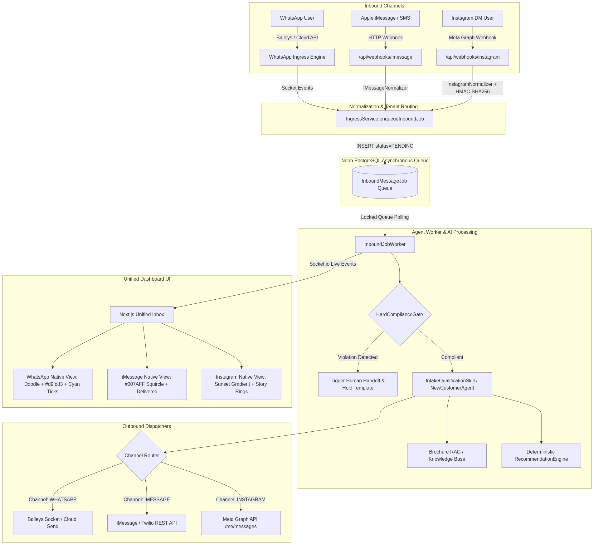
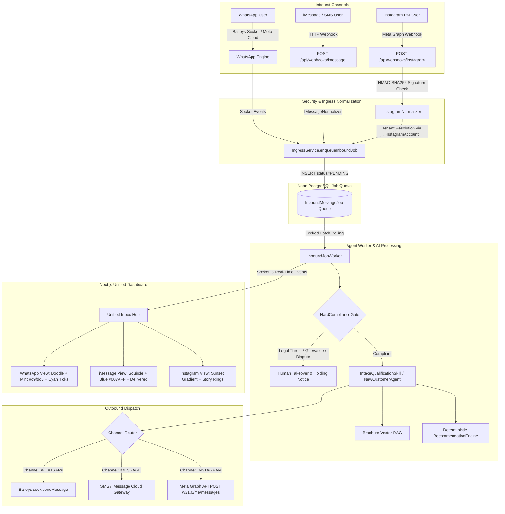
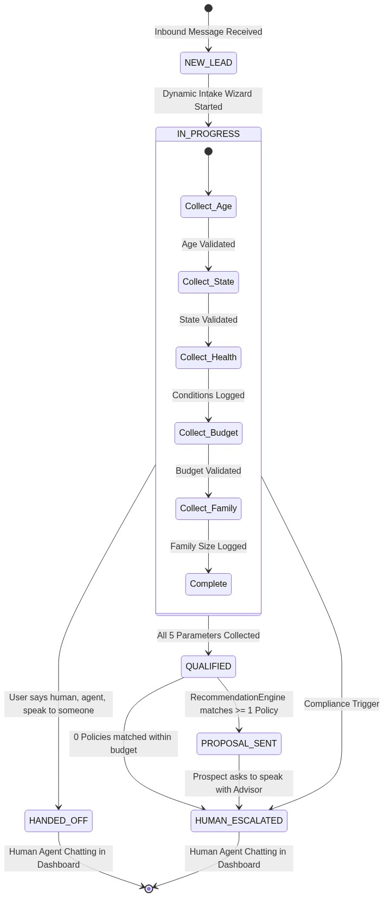
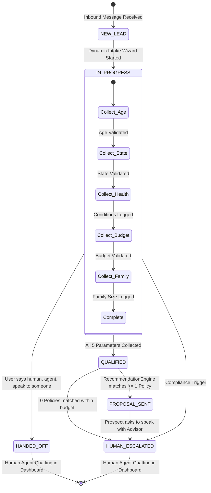

# Multi-Channel Expansion: User Requirements, Technical Flows & Prompts Specification

This document provides a complete record of the journey to expand **OneAIAssist** from a WhatsApp-only system into a multi-channel platform supporting **Apple iMessage / SMS**, **Instagram Direct**, and **WhatsApp**, featuring channel-specific native chat interfaces.

It connects every prompt and instruction provided by the user with the technical flow implemented and the exact AI agent prompts used in production.

---

## Table of Contents
1. [User Journey, Requests & Technical Execution Flow](#1-user-journey-requests--technical-execution-flow)
   - [Milestone 1: Apple iMessage & Cloud SMS Integration](#milestone-1-apple-imessage--cloud-sms-integration)
   - [Milestone 2: Meta Instagram Direct Channel Integration](#milestone-2-meta-instagram-direct-channel-integration)
   - [Milestone 3: Separate Sections & Exact Native Chat Interfaces](#milestone-3-separate-sections--exact-native-chat-interfaces)
   - [Milestone 4: Operational Verification & Server Orchestration](#milestone-4-operational-verification--server-orchestration)
2. [End-to-End System Architecture Diagram](#2-end-to-end-system-architecture-diagram)
3. [Channel-by-Channel Technical Specifications](#3-channel-by-channel-technical-specifications)
4. [Exact Production AI Prompts (Verbatim Code Copy)](#4-exact-production-ai-prompts-verbatim-code-copy)
5. [Meta Instagram Credentials Guide](#5-meta-instagram-credentials-guide)

---

## 1. User Journey, Requests & Technical Execution Flow

---

### Milestone 1: Apple iMessage & Cloud SMS Integration

#### Exact User Prompt 1 (Initial Direction & Research Request)
> *"super nice ok research so now we need to integrate the imessage and the sms you understand what i am saying and i know that the openclaw has the imessage and sms integrationyou understnd what i ams aying explain me and do the research deeply find the arechituctre and explain me the architucture and draw it show e because as same as we are sending the messages to the whatsapp same like that we need todofor the imessage and sms toyou understand wha tiam saying explain me dont implement"*

#### Technical Implementation Flow Executed
1. Researched OpenClaw repository's message handling patterns.
2. Analyzed transport differences between WhatsApp (persistent WebSocket via Baileys) vs. iMessage/SMS (HTTP Webhook push + REST API dispatch).
3. Mapped the unified schema changes needed in Neon PostgreSQL (`CustomerChannel` enum updated to include `IMESSAGE` and `INSTAGRAM`).

---

#### Exact User Prompt 2 (Hardware Constraint & Option Selection)
> *"we dont want to have the openclaw right we really require the openclawshouldberunning in themacmini ? can you explain me dont implement untill i say ok"*
>
> *"so i have a constraints so i dont have the mac mini and is only way to integrate the openclaw too in ourapplication tohavethe imessages integration ? you understand whati am saying explain me dont implement until i say"*
>
> *"as of now we will implement the option 1"*

#### Technical Implementation Flow Executed
1. **Option 1 Implementation (Cloud-native Gateway)**: Removed any requirement for a local physical Mac Mini server running AppleScript.
2. Built `IMessageNormalizer` (`whatsapp-engine/IMessageNormalizer.ts`) to ingest standard JSON payloads from cloud SMS/iMessage gateways.
3. Created the webhook route `whatsapp-engine/routes/imessageWebhook.ts`:
   - `GET /api/webhooks/imessage` (health check).
   - `POST /api/webhooks/imessage` (payload validation, normalizes sender phone, enqueues into `InboundMessageJob` table with `channel: 'IMESSAGE'`).
4. Extended `InboundJobWorker` to route outbound messages via SMS/iMessage REST dispatchers.

---

#### Exact User Prompt 3 (Testing & Blue iMessage Tag Verification)
> *"we added the imessage integration right can you guide me to test it and run the server"*
>
> *"i didnt see the The conversation from +15554321987 marked with the blue iMessage tag can you show me i am giving the browser access can you run the server ad show me"*

#### Technical Implementation Flow Executed
1. Seeded active test conversations in Neon PostgreSQL with `channel = 'IMESSAGE'` and customer primary phone `+15554321987`.
2. Updated `app/(dashboard)/dashboard/inbox/page.tsx` with dedicated channel pill badges:
   - WhatsApp badge: Green with chat icon.
   - iMessage badge: Blue (`#007AFF`) with text indicator.
   - Instagram badge: Gradient purple-rose with Direct icon.
3. Automated browser inspection via Chrome DevTools to verify that the conversation rendered in the inbox list with the blue iMessage badge.

---

### Milestone 2: Meta Instagram Direct Channel Integration

#### Exact User Prompt 1 (Strategic Pivot to Instagram)
> *"/browser leave this before we implement the andriod we need to add the instagram channel also you understand waht i am saying explain me dont implement until i say do research i am giving the browser accesss to ok and gvethe implementation plan for instagram integration ok and how we are going to add this in our website"*

#### Technical Implementation Flow Executed
1. Researched official Meta Instagram Messaging API (Instagram Graph API v21.0).
2. Defined webhook requirements: `hub.mode`, `hub.verify_token`, `hub.challenge`, and HMAC-SHA256 signature verification via `x-hub-signature-256`.
3. Created an implementation plan covering database schema additions (`InstagramAccount` model), webhook handlers, and outbound senders.

---

#### Exact User Prompt 2 (Approval to Proceed)
> *"ok proceed with plan"*

#### Technical Implementation Flow Executed
1. Added `InstagramAccount` table to `prisma/schema.prisma`:
   ```prisma
   model InstagramAccount {
     id                  String   @id @default(uuid())
     tenantId            String
     instagramId         String   @unique
     username            String?
     pageId              String
     encryptedPageToken  String
     createdAt           Date     @default(now())
   }
   ```
2. Ran `npx prisma db push` to synchronize schema with Neon PostgreSQL.
3. Built `InstagramNormalizer.ts` to parse inbound webhook events:
   - Extracts `sender.id` (Instagram-scoped user ID).
   - Extracts `recipient.id` (Business Instagram ID).
   - Extracts text content and media attachment URLs.
4. Created `whatsapp-engine/routes/instagramWebhook.ts`:
   - `GET /api/webhooks/instagram`: Meta verification handshake.
   - `POST /api/webhooks/instagram`: HMAC-SHA256 validation, multi-tenant resolution, and asynchronous job queuing.
5. Built `whatsapp-engine/services/instagramSender.ts`:
   - Outbound sender calling `POST https://graph.facebook.com/v21.0/me/messages` with decrypted Page Access Token.

---

#### Exact User Prompt 3 (Acquiring Credentials)
> *"super now can you guide me to get this credentials :*
> *Instagram Business Account ID (e.g. 17841400000000000)*
> *Instagram Handle / Username (e.g. @primemarketing_ai)*
> *Connected Facebook Page ID (e.g. 102938475610293)*
> *Page Access Token (Encrypted AES-256)"*

#### Technical Implementation Flow Executed
1. Delivered a step-by-step tutorial guiding the user through:
   - Converting an Instagram account to a Professional/Business account.
   - Connecting it to a Facebook Business Page.
   - Creating a Meta App under Meta for Developers with `Instagram Graph API` permissions.
   - Generating a never-expiring Page Access Token via Graph API Explorer.
2. Built a secure API endpoint `POST /api/tenant/integrations/instagram` with AES-256 encryption for the token.

---

#### Exact User Prompt 4 (Raising the Pull Request)
> *"can you raise the pr request"*

#### Technical Implementation Flow Executed
1. Committed all Instagram backend and frontend integration files.
2. Pushed branch `feat/imessage-sms-integration` to `https://github.com/alphaesAI/oneaiassist.git`.
3. Created GitHub Pull Request #3 with detailed documentation of changed files, schemas, and security protections.

---

### Milestone 3: Separate Sections & Exact Native Chat Interfaces

#### Exact User Prompt 1 (The Core Architecture & Design Instruction)
> *"super now i see buti need seperate sections for the instagram,imessages and whatsapp seperatlyyou understand waht i am saying also for this three i want different type of interface instagram chat inteface,imessage interface and whatsapp chat interface you understand waht iam saying explain me dont implement untill i say do brain strom iwant exact intrface of theirs ok do brain strom i am giving thebrowser access to ok/browser"*

#### Technical Implementation Flow Executed
1. Researched the authentic design systems for all three platforms:
   - **WhatsApp Web**: `#efeae2` beige doodle chat wallpaper, `#d9fdd3` sent bubbles, micro cyan checkmarks `✓✓`, corner tick tails, rounded attachment dock.
   - **Apple iOS iMessage**: `#007AFF` blue squircle bubbles, `#E9E9EB` recipient gray bubbles, `"Delivered"` sub-bubble receipts, iOS pill composer with App Store / Camera / Audio wave icons.
   - **Instagram Direct**: 3-color sunset gradient outbound bubbles (`#833AB4` → `#FD1D1D` → `#F77737`), `#efefef` neutral inbound pills, story ring avatar with official gradient border, double-tap heart indicator, and action tray.
2. Implemented modular, dedicated chat view components:
   - `components/chat/WhatsAppChatView.tsx`
   - `components/chat/IMessageChatView.tsx`
   - `components/chat/InstagramChatView.tsx`
3. Built the **Channel Hub Selector Bar** in `app/(dashboard)/dashboard/inbox/page.tsx` with dedicated filters:
   - `All Channels` (auto-detects channel per conversation and loads matching interface).
   - `WhatsApp` (filters strictly to WhatsApp and locks interface to WhatsApp Web design).
   - `Apple iMessage` (filters strictly to iMessage and locks interface to iOS iMessage design).
   - `Instagram Direct` (filters strictly to Instagram and locks interface to Instagram Direct design).

---

#### Exact User Prompt 2 (Approval to Proceed)
> *"ok proceed"*

#### Technical Implementation Flow Executed
1. Integrated the 3 native views into the main unified inbox layout.
2. Preserved the customer intake profile drawer on the right sidebar across all 3 interfaces.
3. Connected outbound message submission handlers across all three views so agents can type and reply natively in any channel view.

---

### Milestone 4: Operational Verification & Server Orchestration

#### Exact User Prompt 1 (Server Start & Testing Request)
> *"can yourun thesever again"*

#### Technical Implementation Flow Executed
1. Ran `npx tsc --noEmit` and resolved an unclosed container `<div>` tag balance in `app/(dashboard)/dashboard/inbox/page.tsx`.
2. Verified port availability on `3000` (Next.js dashboard) and `3001` (WhatsApp & multi-channel backend engine).
3. Launched both processes under background daemon task `npm run dev:all`.
4. Verified HTTP responses via `curl -s -i http://localhost:3000/login` (`200 OK`) and `curl -s -i http://localhost:3000/dashboard/inbox` (`307 Redirect` to session login).

---

## 2. End-to-End System Architecture Diagram





---

## 3. Channel-by-Channel Technical Specifications

| Channel Feature | WhatsApp | Apple iMessage / SMS | Meta Instagram Direct |
| :--- | :--- | :--- | :--- |
| **Inbound Transport** | Persistent WebSocket (Baileys) / Cloud API | Webhook HTTP POST (`/api/webhooks/imessage`) | Meta Graph Webhook (`/api/webhooks/instagram`) |
| **Security / Verification** | Encrypted Session Data in DB / Token | Bearer API Secret | HMAC-SHA256 (`x-hub-signature-256`) + Token Handshake |
| **Outbound Transport** | Baileys `sock.sendMessage()` | REST SMS / Messages API Gateway | Meta Graph API `POST /v21.0/me/messages` |
| **Primary Identifier** | E.164 Phone Number (`15551234567`) | E.164 Phone Number (`15554321987`) | Instagram-Scoped ID (IGSID) (`178414000123456`) |
| **Sent Bubble Style** | Mint Green (`#d9fdd3`) with top tick tail | Apple Blue (`#007AFF`) squircle pill | Sunset Gradient (`#833AB4` → `#FD1D1D` → `#F77737`) |
| **Received Bubble Style** | White card (`#ffffff`) with shadow & tail | Apple Light Gray (`#E9E9EB`) | Neutral Pill (`#efefef` `rounded-[22px]`) |
| **Delivery Receipts** | Inline cyan micro double-ticks (`✓✓`) | Sub-bubble `"Delivered"` receipt text | Sub-bubble `"Sent"` indicator |
| **Input Dock Actions** | Emoji, Paperclip attachment, Mic button | iOS App Store, Camera, Audio waveform | Camera, Voice, Gallery, Double-tap Heart |

---

## 4. Exact Production AI Prompts (Verbatim Code Copy)

Every prompt below is extracted directly from the system codebase without modifications.

---

### Prompt 1: Lead Parameter Data Extraction Bot
- **File**: `lib/claw/IntakeQualificationSkill.ts` (Lines 76–88)
- **Purpose**: Parses unstructured customer responses and extracts structured JSON parameters.

```text
You are a data extraction bot. Your job is to extract insurance qualification fields from the user message.
Extract these fields if present in the message:
- age (integer number)
- state (2-letter US state code, uppercase)
- healthConditions (pre-existing health conditions or 'None')
- budgetMin (integer monthly premium min budget in dollars)
- budgetMax (integer monthly premium max budget in dollars)
- familySize (integer family members to be covered)

User message: "${userMessage}"

Respond ONLY with a JSON object. Do not include markdown wraps or anything else.
Example: {"age": 35, "state": "TX"}
```

---

### Prompt 2: Turn-by-Turn Conversational Intake Guide
- **File**: `lib/claw/IntakeQualificationSkill.ts` (Lines 272–284)
- **Purpose**: Dynamically asks for the next missing intake parameter one at a time.

```text
You are a professional insurance sales agent guide assisting a lead over WhatsApp.
${customQuestionsBlock}Your goal is to guide the conversation to collect qualification details:
1. Age
2. US State of residence
3. Pre-existing health conditions
4. Monthly premium budget (min and max monthly amount in dollars)
5. Family size

Already collected: ${JSON.stringify(updatedFields)}.
Remaining missing fields: ${missing.join(', ')}.

Ask a polite, warm question over WhatsApp requesting the next missing parameter: "${missing[0]}". Do not ask for everything at once. Keep the tone human-friendly.
```

---

### Prompt 3: Catalog Policy Match Explanation & Proposal
- **File**: `lib/claw/IntakeQualificationSkill.ts` (Lines 228–236)
- **Purpose**: Explains matched policies to the prospect once all qualification criteria are satisfied.

```text
I have qualified the lead and matched the following matching policies in the catalog:
- Plan: ${p.name}, Insurer: ${p.insurerName}, Monthly Premium: $${(p.premiumMin / 100).toFixed(2)}-$${(p.premiumMax / 100).toFixed(2)}, Sum Insured: $${(p.sumInsured / 100).toLocaleString()}, Summary: ${p.extractedSummary}

Please explain these options to the user in a very warm, plain language summary (premiums, sum insured, exclusions, waiting periods). Ask which plan they would prefer.
```

---

### Prompt 4: Grounded Multi-Candidate Recommendation Engine
- **File**: `whatsapp-engine/agents/RecommendationEngine.ts` (Lines 146–169)
- **Purpose**: Strictly grounds policy recommendations in SQL-filtered database results to prevent hallucination.

```text
System:
You are a professional WhatsApp health insurance assistant. Ground all recommendations strictly in the supplied policy list.

User:
You are an expert, licensed health insurance advisor. Recommend the top matching insurance policies for this prospect based on their collected profile.

PROSPECT PROFILE:
- Age: ${intakeData.age || 'Not specified'}
- State: ${userState || 'Not specified'}
- Monthly Budget: Up to $${budgetMaxDollars}/mo
- Family Size: ${intakeData.familySize || 1}
- Conditions: ${Array.isArray(intakeData.healthConditions) ? intakeData.healthConditions.join(', ') : 'None'}

ALLOWED POLICY CANDIDATES (STRICT WHITELIST - DO NOT INVENT OR ALTER ANY POLICY NAMES, PRICES, OR CARRIERS):
${JSON.stringify(candidateWhitelist, null, 2)}

INSTRUCTIONS:
1. Present the top 2 candidate options (e.g. Option A: Best Value vs Option B: Maximum Coverage).
2. Clearly list Policy Name, Insurer, Monthly Premium Range, and Max Sum Insured.
3. Keep the tone friendly, professional, and clear for WhatsApp chat.
4. Conclude with a clear Call to Action (e.g., "Which option would you like to explore, or shall I have an agent call you to assist?").
5. DO NOT mention policies outside the provided whitelist.
```

---

### Prompt 5: Brochure RAG & Mid-Flow Q&A Answering
- **File**: `whatsapp-engine/agents/NewCustomerAgent.ts` (Lines 375–382)
- **Purpose**: Answers prospect side questions using vector brochure context and returns to the quote step.

```text
System:
You are an insurance advisor. Answer the user question in 1-2 concise, clear sentences based strictly on the provided context.

User:
CONTEXT:
${ragResults.map((r) => r.text).join('\n---\n')}

QUESTION: ${rawMessage}
```

*Appended return suffix*:
```text
👉 *Returning to your quote:* ${currentQuestion.questionPrompt}
```

---

### Prompt 6: Hard Compliance Gate Holding Templates
- **File**: `whatsapp-engine/agents/HardComplianceGate.ts` (Lines 12–47)
- **Purpose**: Deterministically halts AI operations and assigns conversation to human supervisor upon legal or regulatory triggers.

| Intent Trigger | Detection Regex Keywords | Holding Message Delivered to Customer |
| :--- | :--- | :--- |
| **Legal Threat** | `lawsuit`, `attorney`, `lawyer`, `sue you`, `litigation`, `subpoena` | *"We have logged your communication regarding legal representation. Your conversation has been immediately transferred to our Compliance and Legal Supervision team. A representative will contact you directly."* |
| **Regulatory Complaint** | `insurance commissioner`, `department of insurance`, `doi complaint`, `cfpb`, `ombudsman` | *"We take regulatory inquiries very seriously. This matter has been escalated to our Senior Compliance Officer for immediate formal review and follow-up."* |
| **Claim Dispute** | `claim was denied`, `claim rejected`, `bad faith`, `wrongful denial`, `appeal claim` | *"We understand you are disputing a recent claim determination. To ensure full compliance with state claims settlement guidelines, your file is now assigned to a Licensed Claims Supervisor who will review the adjudication details."* |
| **Grievance / Fraud** | `formal complaint`, `grievance`, `fraud`, `scam`, `unauthorized charge`, `illegal practice` | *"Your formal grievance has been registered. Our Quality & Compliance team is reviewing your account history and will reach out promptly."* |
| **Policy Cancellation** | `cancel my policy`, `terminate coverage`, `stop my insurance`, `surrender policy` | *"We have received your policy cancellation request. A licensed retention specialist has been assigned to assist you with the necessary termination documentation and statutory notice period requirements."* |

---

### State Transition & Human Takeover Diagram





---

## 5. Meta Instagram Credentials Guide

To connect a live Instagram Professional account to OneAIAssist:

1. **Convert to Professional Account**:
   - In the Instagram mobile app: `Settings` → `Account type and tools` → `Switch to professional account` (choose **Business**).
2. **Connect to Facebook Page**:
   - `Settings` → `Creator / Business tools` → `Connect a Facebook Page` (select or create your agency page).
3. **Enable Message Access**:
   - In Instagram app: `Settings` → `Messages and story replies` → `Message controls` → Turn ON **"Allow access to messages"**.
4. **Retrieve IDs via Meta for Developers**:
   - Go to [developers.facebook.com](https://developers.facebook.com).
   - In Graph API Explorer, run `GET /me/accounts` to find your `page_id` and Page Access Token.
   - Run `GET /{page-id}?fields=instagram_business_account` to get your `Instagram Business Account ID`.
5. **Save in Dashboard Settings**:
   - Navigate to `http://localhost:3000/dashboard/settings` and enter your credentials. Tokens are encrypted using AES-256 before writing to PostgreSQL.
