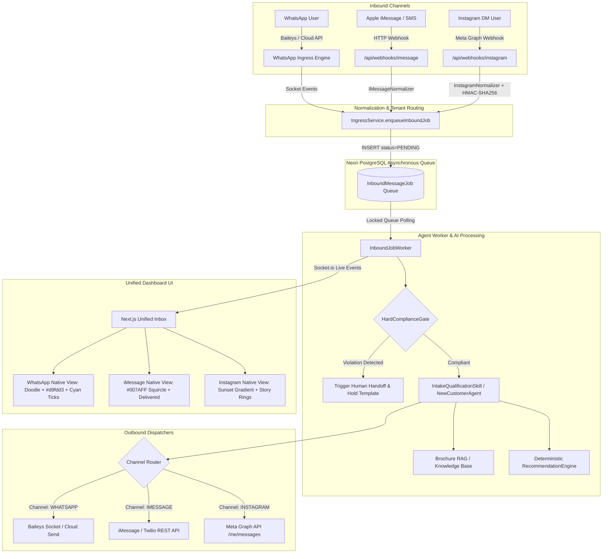
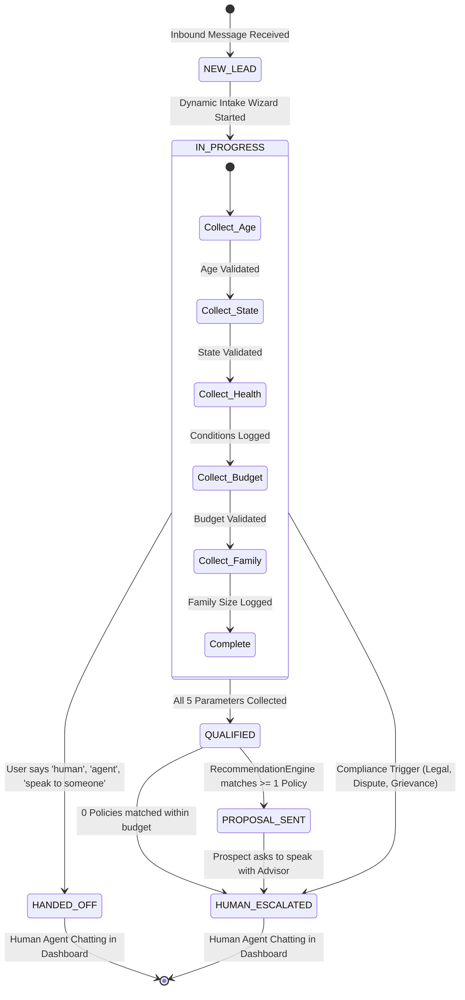

# Multi-Channel Architecture, Workflows & Exact Prompts Specification

This document provides a comprehensive technical reference for the multi-channel AI communication system supporting **WhatsApp**, **Apple iMessage**, and **Instagram Direct**. It details the end-to-end data flow, ingress webhooks, stateful intake loops, and the exact system prompts used in production.

---

## 1. System Architecture & Multi-Channel Ingress Flow

Each messaging channel operates with dedicated ingress normalizers and handlers, feeding into an asynchronous job queue processed by the dual-agent engine before routing outbound replies back through the corresponding channel gateway.



---

## 2. Channel-by-Channel Breakdown

---

### Channel 1: Instagram Direct Messages

#### 1. Ingress & Webhook Endpoint
- **Verification Endpoint (`GET`)**: `/api/webhooks/instagram`
  - Validates `hub.mode === 'subscribe'` and compares `hub.verify_token` against `META_VERIFY_TOKEN`.
  - Responds with `hub.challenge` to establish webhook subscriptions on Meta App Dashboard.
- **Inbound Event Handler (`POST`)**: `/api/webhooks/instagram`
  - Validates `x-hub-signature-256` using HMAC-SHA256 with `META_APP_SECRET`.
  - Parses payload with `InstagramNormalizer.parsePayload(body)`.
  - Resolves multi-tenant ownership: maps `recipient.id` (Instagram Professional Account ID) to `tenantId` via `prisma.instagramAccount`.
  - Enqueues into `InboundMessageJob` with `channel: 'INSTAGRAM'`.

#### 2. Outbound Dispatch
- **Endpoint**: `POST https://graph.facebook.com/v21.0/me/messages`
- **Headers**: `Authorization: Bearer <PAGE_ACCESS_TOKEN>`, `Content-Type: application/json`
- **Payload Structure**:
  ```json
  {
    "recipient": { "id": "<IG_SENDER_SCOPED_ID>" },
    "message": { "text": "<AI_REPLY_TEXT>" }
  }
  ```

#### 3. Native Dashboard UI Representation
- **Visual Design**:
  - Story ring avatar with official Instagram purple-orange gradient (`from-[#f09433] via-[#dc2743] to-[#bc1888]`).
  - Outbound message bubbles styled with the vibrant 3-color sunset gradient: `bg-gradient-to-r from-[#833AB4] via-[#FD1D1D] to-[#F77737]`.
  - Inbound bubbles: subtle neutral pill (`bg-[#efefef] rounded-[22px]`).
  - Double-tap heart reaction badge and native Instagram action tray (Camera, Mic, Gallery, Heart).

---

### Channel 2: Apple iMessage / SMS

#### 1. Ingress & Webhook Endpoint
- **Health Check (`GET`)**: `/api/webhooks/imessage`
  - Responds with `{ status: 'active', channel: 'IMESSAGE' }`.
- **Inbound Event Handler (`POST`)**: `/api/webhooks/imessage`
  - Ingests incoming Apple Business Chat / Cloud SMS webhook payloads.
  - Normalizes payloads via `IMessageNormalizer.normalize(payload)` extracting `sender`, `text`, and `messageId`.
  - Resolves tenant and enqueues job with `channel: 'IMESSAGE'`.

#### 2. Outbound Dispatch
- Formats payload as standard E.164 phone destination and dispatches outbound text via the active SMS/iMessage gateway.

#### 3. Native Dashboard UI Representation
- **Visual Design**:
  - Outbound bubbles: Official Apple iMessage blue (`bg-[#007AFF] text-white`).
  - Bubble geometry: High-radius squircle (`rounded-2xl`).
  - Delivery indicators: Native Apple sub-bubble receipts (`Delivered` in `#8E8E93` 10px text below last outbound message).
  - Inbound bubbles: Apple light gray (`bg-[#E9E9EB] text-black`).
  - Input Dock: Rounded pill composer with iOS App Store icon, Camera icon, and Audio wave button.

---

### Channel 3: WhatsApp

#### 1. Ingress & Connection
- **Transport**: Dual-stack connection supporting `@whiskeysockets/baileys` socket integration and Meta WhatsApp Cloud API.
- Emits real-time QR codes (`whatsapp_qr`) or pairing codes (`whatsapp_pairing_code`) for seamless agency phone linking.
- Updates message delivery statuses (`SENT` → `DELIVERED` → `READ`) with live Socket.io events.

#### 2. Outbound Dispatch
- Dispatches messages via Baileys `sock.sendMessage(jid, { text: botReplyText })` or Cloud API `POST /{phone-number-id}/messages`.

#### 3. Native Dashboard UI Representation
- **Visual Design**:
  - Iconic WhatsApp doodle wallpaper background (`#efeae2`).
  - Outbound bubbles: Authentic WhatsApp mint green (`bg-[#d9fdd3] text-[#111b21]`) with top-right corner tick tail.
  - Delivery indicators: Micro double-checkmark `✓✓` colored in WhatsApp cyan (`text-[#53bdeb]`).
  - Inbound bubbles: Clean white card (`bg-white`) with subtle drop shadow and left corner tail.
  - Input Dock: Emoji picker, paperclip attachment menu, voice microphone button.

---

## 3. Exact Prompts Used in the System

All prompts listed below are copied verbatim from the system implementation.

---

### Prompt 1: Lead Parameter Data Extraction Bot
- **File**: `lib/claw/IntakeQualificationSkill.ts` (Lines 76–88)
- **Role**: Deterministically extracts insurance qualification parameters from incoming natural language messages.

```text
You are a data extraction bot. Your job is to extract insurance qualification fields from the user message.
Extract these fields if present in the message:
- age (integer number)
- state (2-letter US state code, uppercase)
- healthConditions (pre-existing health conditions or 'None')
- budgetMin (integer monthly premium min budget in dollars)
- budgetMax (integer monthly premium max budget in dollars)
- familySize (integer family members to be covered)

User message: "${userMessage}"

Respond ONLY with a JSON object. Do not include markdown wraps or anything else.
Example: {"age": 35, "state": "TX"}
```

---

### Prompt 2: Step-by-Step Conversational Intake Guide
- **File**: `lib/claw/IntakeQualificationSkill.ts` (Lines 272–284)
- **Role**: Prompts the user turn-by-turn for the next missing intake parameter without overwhelming them.

```text
You are a professional insurance sales agent guide assisting a lead over WhatsApp.
${customQuestionsBlock}Your goal is to guide the conversation to collect qualification details:
1. Age
2. US State of residence
3. Pre-existing health conditions
4. Monthly premium budget (min and max monthly amount in dollars)
5. Family size

Already collected: ${JSON.stringify(updatedFields)}.
Remaining missing fields: ${missing.join(', ')}.

Ask a polite, warm question over WhatsApp requesting the next missing parameter: "${missing[0]}". Do not ask for everything at once. Keep the tone human-friendly.
```

---

### Prompt 3: Catalog Policy Match Explanation & Proposal
- **File**: `lib/claw/IntakeQualificationSkill.ts` (Lines 228–236)
- **Role**: Explains matching policies in plain, warm language once all qualification criteria are satisfied.

```text
I have qualified the lead and matched the following matching policies in the catalog:
- Plan: ${p.name}, Insurer: ${p.insurerName}, Monthly Premium: $${(p.premiumMin / 100).toFixed(2)}-$${(p.premiumMax / 100).toFixed(2)}, Sum Insured: $${(p.sumInsured / 100).toLocaleString()}, Summary: ${p.extractedSummary}

Please explain these options to the user in a very warm, plain language summary (premiums, sum insured, exclusions, waiting periods). Ask which plan they would prefer.
```

---

### Prompt 4: Grounded Multi-Candidate Policy Recommendation Engine
- **File**: `whatsapp-engine/agents/RecommendationEngine.ts` (Lines 146–169)
- **Role**: Strict zero-hallucination recommendation prompt that only ranks pre-filtered whitelist candidates from the database.

```text
System:
You are a professional WhatsApp health insurance assistant. Ground all recommendations strictly in the supplied policy list.

User:
You are an expert, licensed health insurance advisor. Recommend the top matching insurance policies for this prospect based on their collected profile.

PROSPECT PROFILE:
- Age: ${intakeData.age || 'Not specified'}
- State: ${userState || 'Not specified'}
- Monthly Budget: Up to $${budgetMaxDollars}/mo
- Family Size: ${intakeData.familySize || 1}
- Conditions: ${Array.isArray(intakeData.healthConditions) ? intakeData.healthConditions.join(', ') : 'None'}

ALLOWED POLICY CANDIDATES (STRICT WHITELIST - DO NOT INVENT OR ALTER ANY POLICY NAMES, PRICES, OR CARRIERS):
${JSON.stringify(candidateWhitelist, null, 2)}

INSTRUCTIONS:
1. Present the top 2 candidate options (e.g. Option A: Best Value vs Option B: Maximum Coverage).
2. Clearly list Policy Name, Insurer, Monthly Premium Range, and Max Sum Insured.
3. Keep the tone friendly, professional, and clear for WhatsApp chat.
4. Conclude with a clear Call to Action (e.g., "Which option would you like to explore, or shall I have an agent call you to assist?").
5. DO NOT mention policies outside the provided whitelist.
```

---

### Prompt 5: Brochure RAG & In-Flow Question Answering
- **File**: `whatsapp-engine/agents/NewCustomerAgent.ts` (Lines 375–382)
- **Role**: Answers side questions from prospects during intake using vector search across policy brochures, then seamlessly resumes the intake flow.

```text
System:
You are an insurance advisor. Answer the user question in 1-2 concise, clear sentences based strictly on the provided context.

User:
CONTEXT:
${ragResults.map((r) => r.text).join('\n---\n')}

QUESTION: ${rawMessage}
```

*Flow resume suffix appended to response*:
```text
👉 *Returning to your quote:* ${currentQuestion.questionPrompt}
```

---

### Prompt 6: General Warmth Assistant (Fallback)
- **File**: `whatsapp-engine/engine-logic.ts` (Line 264)
- **Role**: Fallback warmth prompt for non-intake interactions.

```text
System:
You are a professional insurance sales agent assisting a customer. Answer their questions warmly.
```

---

### Prompt 7: Hard Compliance Gate Holding Templates
- **File**: `whatsapp-engine/agents/HardComplianceGate.ts` (Lines 12–47)
- **Role**: Immediate fail-closed response templates delivered to the user before cutting off automated AI and alerting a human supervisor.

| Intent Trigger | Detection Regex Keywords | Holding Message Delivered to Customer |
| :--- | :--- | :--- |
| **Legal Threat** | `lawsuit`, `attorney`, `lawyer`, `sue you`, `litigation`, `subpoena` | *"We have logged your communication regarding legal representation. Your conversation has been immediately transferred to our Compliance and Legal Supervision team. A representative will contact you directly."* |
| **Regulatory Complaint** | `insurance commissioner`, `department of insurance`, `doi complaint`, `cfpb`, `ombudsman` | *"We take regulatory inquiries very seriously. This matter has been escalated to our Senior Compliance Officer for immediate formal review and follow-up."* |
| **Claim Dispute** | `claim was denied`, `claim rejected`, `bad faith`, `wrongful denial`, `appeal claim` | *"We understand you are disputing a recent claim determination. To ensure full compliance with state claims settlement guidelines, your file is now assigned to a Licensed Claims Supervisor who will review the adjudication details."* |
| **Grievance / Fraud** | `formal complaint`, `grievance`, `fraud`, `scam`, `unauthorized charge`, `illegal practice` | *"Your formal grievance has been registered. Our Quality & Compliance team is reviewing your account history and will reach out promptly."* |
| **Policy Cancellation** | `cancel my policy`, `terminate coverage`, `stop my insurance`, `surrender policy` | *"We have received your policy cancellation request. A licensed retention specialist has been assigned to assist you with the necessary termination documentation and statutory notice period requirements."* |

---

## 4. State Transition & Human Takeover Logic



1. **Deterministic Handoff**: If the user sends any trigger keyword (`human`, `agent`, `representative`, `speak to a person`), `IntakeQualificationSkill` immediately sets `lead.status = 'HANDED_OFF'`, `conversation.needsEscalation = true`, and suspends the AI agent.
2. **Deterministic Compliance Fail-Closed**: Any regex match in `HardComplianceGate` instantly updates the conversation to human takeover and emits a high-priority banner to the dashboard inbox.
3. **Session Resumption**: If a prospect asks an informational question mid-intake, the system increments `interruptionCount`, answers via RAG, and immediately re-prompts the active step. If interruptions exceed 3, the agent firmly redirects focus back to the quote collection before proceeding.
