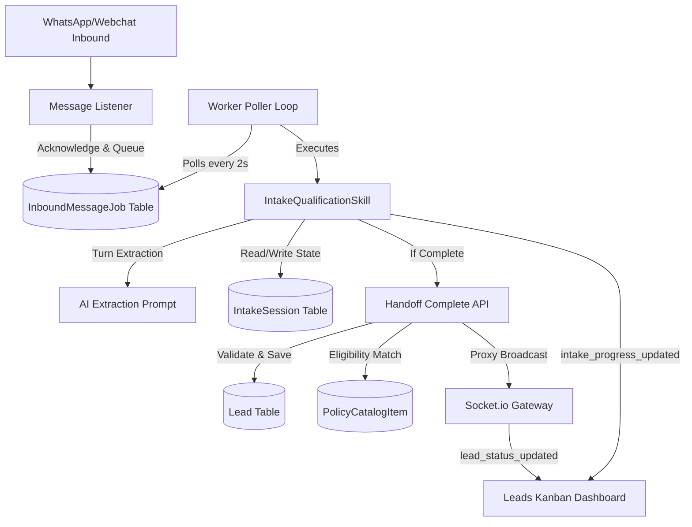

# OpenClaw + Stateful AI Intake Flow Integration Guide

This document describes the design, database schema, background worker queue, and frontend real-time dashboard updates for the stateful AI Intake Qualification Flow using **OpenClaw**.

---

## 1. Architecture Overview
The intake qualification architecture is designed to handle WhatsApp, Webchat, and other inbound channels asynchronously, ensuring tenant isolation, structured data extraction, and real-time live dashboard updates.



---

## 2. Database Models (`prisma/schema.prisma`)

### A. IntakeSession Model
Provides persistent state tracking for a Lead's turn qualification progress.

```prisma
enum IntakeSessionStatus {
  IN_PROGRESS
  COMPLETED
  ABANDONED
}

model IntakeSession {
  id              String              @id @default(cuid())
  tenantId        String
  leadId          String              @unique
  customerId      String
  flowId          String
  flowVersion     String
  status          IntakeSessionStatus @default(IN_PROGRESS)
  collectedFields Json                // JSON object holding gathered values (age, state, etc.)
  createdAt       DateTime            @default(now())
  updatedAt       DateTime            @updatedAt
  completedAt     DateTime?

  tenant   Tenant   @relation(fields: [tenantId], references: [id], onDelete: Cascade)
  lead     Lead     @relation(fields: [leadId], references: [id], onDelete: Cascade)
  customer Customer @relation(fields: [customerId], references: [id], onDelete: Cascade)

  @@index([tenantId])
  @@index([leadId])
  @@index([customerId])
}
```

### B. InboundMessageJob Model
A Postgres-backed persistent task queue that decouples inbound webhook message ingestion from heavy AI inference loops.

```prisma
enum InboundJobStatus {
  PENDING
  PROCESSING
  COMPLETED
  FAILED
}

model InboundMessageJob {
  id             String           @id @default(cuid())
  tenantId       String
  conversationId String
  messageId      String
  status         InboundJobStatus @default(PENDING)
  attempts       Int              @default(0)
  lastError      String?
  createdAt      DateTime         @default(now())
  processedAt    DateTime?

  tenant Tenant @relation(fields: [tenantId], references: [id], onDelete: Cascade)

  @@index([tenantId])
  @@index([status, createdAt])
}
```

---

## 3. Stateful Inbound Queue Worker
Instead of invoking LLM auto-responses synchronously inside message webhooks, listeners save the message and enqueue a `PENDING` job:

1. **Baileys listener** in `whatsapp-engine/engine-logic.ts`
2. **OpenWA handler** in `whatsapp-engine/openwa-logic.ts`
3. **Webchat router** in `app/api/tenant/[tenant-slug]/webchat/message/route.ts`

A background poller loop `startInboundJobWorker(io)` polls for pending tasks every 2 seconds, marks them as `PROCESSING`, runs `runAIAgentAutoResponse`, and transitions tasks to `COMPLETED` or `FAILED`.

---

## 4. OpenClaw Skill: `IntakeQualificationSkill`
The `IntakeQualificationSkill` manages conversational qualification:

1. **Extraction**: Runs a structured parser LLM prompt against the customer's last text to extract parameters: `age`, `state`, `healthConditions`, `budgetMin`, `budgetMax`, and `familySize`.
2. **Validation**: Sanitizes fields (e.g. state must be a 2-letter uppercase string, age must be a positive integer) before saving to `IntakeSession.collectedFields`.
3. **Turn Progression**:
   * If fields are missing: Generates a conversational message requesting the *next* missing parameter and emits `intake_progress_updated` over Socket.io.
   * If all fields are satisfied: Calls `/api/bot/intake/complete` to finalize the session.

---

## 5. Handoff Complete API
The completion API endpoint at `app/api/bot/intake/complete/route.ts` completes the wizard:
1. **Transaction Scoping**: Executes inside a single transaction using `getTenantPrisma(tenantId, 'PLATFORM_OWNER')` to maintain Row-Level Security (RLS) policies.
2. **Lead Transition**: Marks the `IntakeSession` as `COMPLETED` and changes `Lead.status` from `APPLICATION_CAPTURED` to `QUALIFIED`.
3. **Eligibility Matching**: Filters catalog items by state list coverage and overlap in monthly premium budget cents ranges. Recommended IDs are stored on `Lead.recommendedPolicyIds`.
4. **Audit Trail**: Logs an `INTAKE_COMPLETE` entry inside the `AuditLog` database table.

---

## 6. Real-Time Layer & Live Frontend UI
- **Socket Emit Gateway**: The API triggers Socket.io broadcasts by sending POST requests to the `/api/whatsapp/emit` proxy endpoint on the Socket server (port 3001).
- **Socket Events**:
  * `lead_status_updated`: Fired when a lead achieves qualified status.
  * `intake_progress_updated`: Fired on every gathered turn parameter.
- **Kanban Live Synchronization**: The leads dashboard (`app/(dashboard)/dashboard/leads/page.tsx`) listens for these events and invalidates TanStack React Query cache keys to reload the board automatically.
- **Kanban Progress Indicators**: Renders a document icon checklist and a visual progress bar (e.g., `4 of 6 fields collected`) inside each lead card driven by the `IntakeSession` fields.
