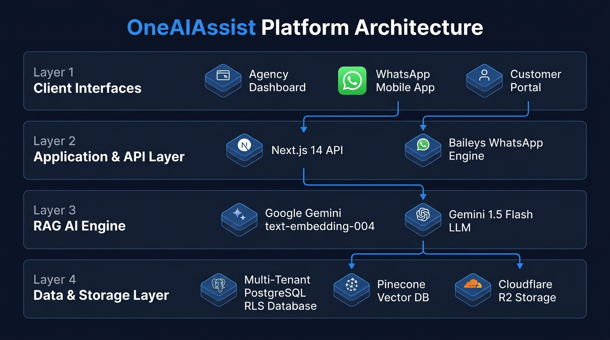
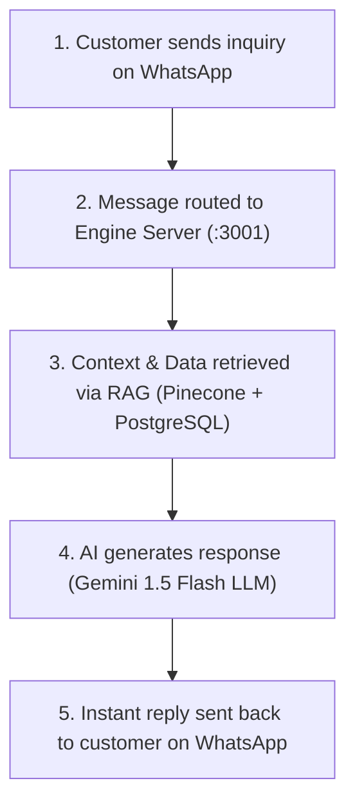
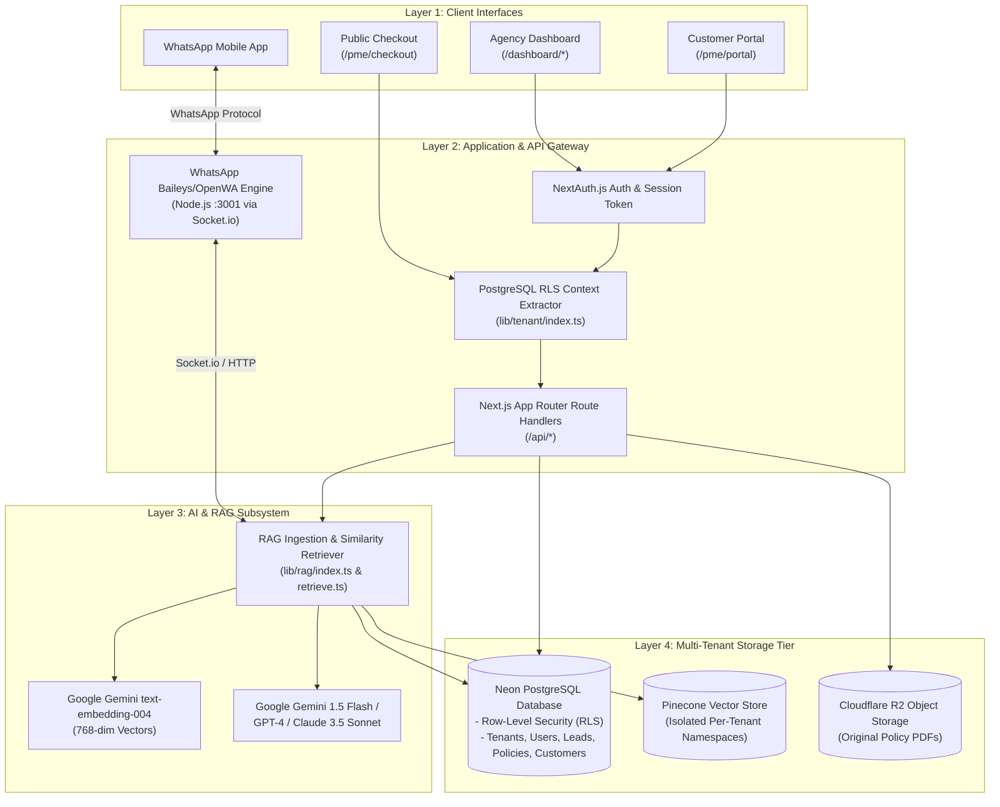
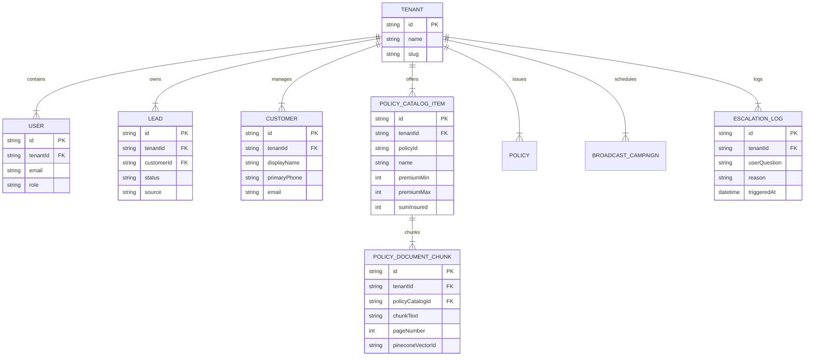
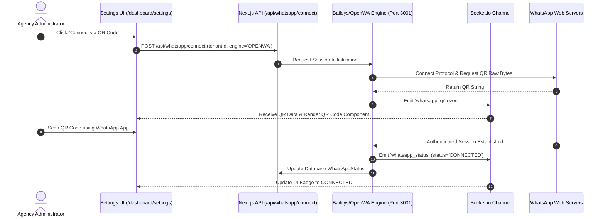
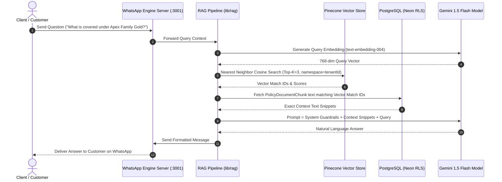

# OneAI Assist — Multi-Tenant System Architecture & Technical Diagrams

> [!NOTE]
> **Platform**: OneAI Assist Multi-Tenant AI SaaS Architecture  
> **Infrastructure**: Next.js 14 App Router + Neon Serverless PostgreSQL (RLS) + Node.js WhatsApp Engine (:3001) + Google Gemini / OpenAI RAG Pipeline + Pinecone Vector Store + Cloudflare R2

---

## Executive Overview

This document contains the authoritative technical architecture diagrams and specification for **OneAI Assist**, detailing all system layers, API request lifecycles, database Row-Level Security (RLS) tenant isolation models, real-time WhatsApp engine messaging, and the RAG (Retrieval-Augmented Generation) intelligence subsystem.

---

## 1. High-Level Technical Architecture Diagram

### Architecture Layer Breakdown

#### Layer 1: Client Interfaces (User Access & Channels)
- **Agency Dashboard (`/dashboard/*`)**: Next.js React UI for agency administrators, managers, and sales agents (Templates, Broadcasts, Leads, Bot Config, Analytics).
- **WhatsApp Client App**: Customer mobile messaging interface for real-time AI bot interactions and lead intake workflows.
- **Customer Self-Service Portal (`/pme/portal`)**: Tenant-branded portal for policyholders to view active coverage, download documents, and request claims.
- **Public Policy Checkout (`/pme/checkout`)**: Public direct-purchase landing page for instant health insurance policy quotes and payment.

#### Layer 2: Application & API Gateway (Routing, Auth & Real-time Engine)
- **Next.js 14 App Router API & NextAuth Middleware**: Handles HTTP route handlers, JWT authentication, role RBAC checks (`ADMIN`, `MANAGER`, `AGENT`), and SSR page rendering.
- **PostgreSQL Row-Level Security (RLS) Tenant Extractor**: Extracts tenant context (`tenantId`, `role`) from session tokens or request headers and executes `SELECT set_config('app.current_tenant_id', ...)` for 100% multi-tenant data isolation.
- **WhatsApp Baileys & OpenWA Engine Server (`Node.js :3001`)**: Dedicated Node.js microservice handling real-time WhatsApp WebSockets, incoming message webhooks, QR code session generation, and `Socket.io` bi-directional event broadcasts.

#### Layer 3: AI & RAG Subsystem (Intelligence Layer)
- **Vector Embedder**: Google Gemini `text-embedding-004` / OpenAI `text-embedding-3-small` generating 768-dimensional dense vector embeddings.
- **RAG Pipeline Engine**: Text chunking engine (1000-char chunks, 200-char overlap) and Top-K Cosine Similarity Retriever (`lib/rag/index.ts` & `retrieve.ts`).
- **Generative LLM Engine**: Multi-model support including Google Gemini 1.5 Flash, GPT-4 Turbo, and Claude 3.5 Sonnet for high-quality, guardrailed agent replies.

#### Layer 4: Multi-Tenant Storage Tier (Persistent Storage & Assets)
- **Neon Serverless PostgreSQL Database**: Primary relational database with RLS enabled (`Tenant`, `User`, `Customer`, `Lead`, `PolicyCatalogItem`, `Policy`, `PolicyDocumentChunk`, `Conversation`, `Message`, `BroadcastCampaign`, `EscalationLog`).
- **Pinecone Vector Store**: Multi-tenant vector index with strict per-tenant namespace isolation (`policy-docs-tenant-001`, `policy-docs-tenant-002`).
- **Cloudflare R2 Object Storage**: S3-compatible, encrypted storage for original policy PDF documents and asset attachments.

---

### Real-Time Conversation Flow

---

## 2. High-Level Component Interaction Diagram

---

## 3. Multi-Tenant Database ER Diagram (Prisma & RLS)

---

## 4. WhatsApp Engine Integration Sequence Diagram

---

## 5. End-to-End RAG Ingestion & Real-Time Query Sequence

