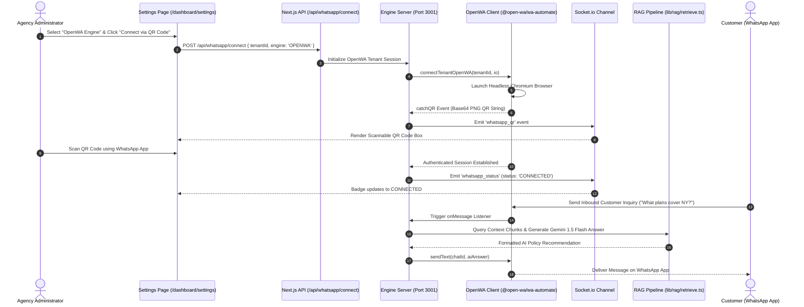

# WhatsApp Engine Architecture & OpenWA Integration Guide

## Executive Overview
The **OneAIAssist WhatsApp Subsystem** manages multi-tenant WhatsApp Business phone number connections, QR code generation, real-time message stream listening, and RAG-powered AI auto-replies.

---

## 1. Engine Provider Breakdown: OpenWA vs. Baileys

| Feature / Metric | OpenWA Engine (`@open-wa/wa-automate`) | Baileys Engine (`@whiskeysockets/baileys`) |
|---|---|---|
| **Underlying Protocol** | Headless Chromium / Web Automation | Direct WhatsApp WebSockets (Proto Buffers) |
| **Primary File** | `whatsapp-engine/openwa-logic.ts` | `whatsapp-engine/engine-logic.ts` |
| **Package Dependency** | `@open-wa/wa-automate` (`v4.76.0`) | `@whiskeysockets/baileys` (`v7.0.0-rc13`) |
| **Best Used For** | Maximum immunity against WhatsApp Web protocol updates | Ultra-lightweight, zero-browser memory footprint |
| **UI Selection** | Agency Settings (`/dashboard/settings`) | Agency Settings (`/dashboard/settings`) |

> [!NOTE]  
> **Clarification Note**: Third-party projects like `openclaw` (a C++ game engine project) are **NOT** used in OneAIAssist. The messaging architecture relies exclusively on **OpenWA** (`@open-wa/wa-automate`) and **Baileys** (`@whiskeysockets/baileys`).

---

## 2. End-to-End Messaging Lifecycle & Sequence Diagram



---

## 3. Directory & File Reference

```
whatsapp-engine/
├── server.ts           # Main Node.js Express & Socket.io server running on port 3001
├── openwa-logic.ts     # OpenWA Chromium engine session initialization & QR handler
├── engine-logic.ts     # Baileys direct WebSocket session handler & AI RAG triggers
└── auth-state.ts       # Multi-tenant session state persistence handler
```

---

## 4. Operational & Troubleshooting Checklist

1. **Starting the WhatsApp Engine Server**:
   ```bash
   npx tsx whatsapp-engine/server.ts
   ```
2. **Checking Active Socket Connections**:
   - The engine runs on `http://localhost:3001` and connects over Socket.io channel `tenant_${tenantId}`.
3. **Switching Engines**:
   - Go to `http://localhost:3000/dashboard/settings`, select your preferred engine (**OpenWA** or **Baileys**), and click **Connect via QR Code**.
